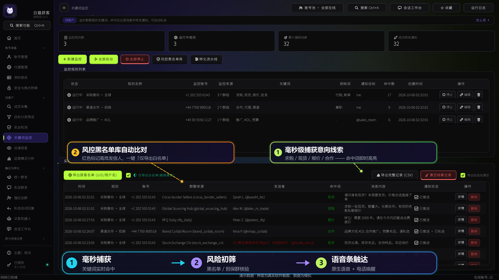
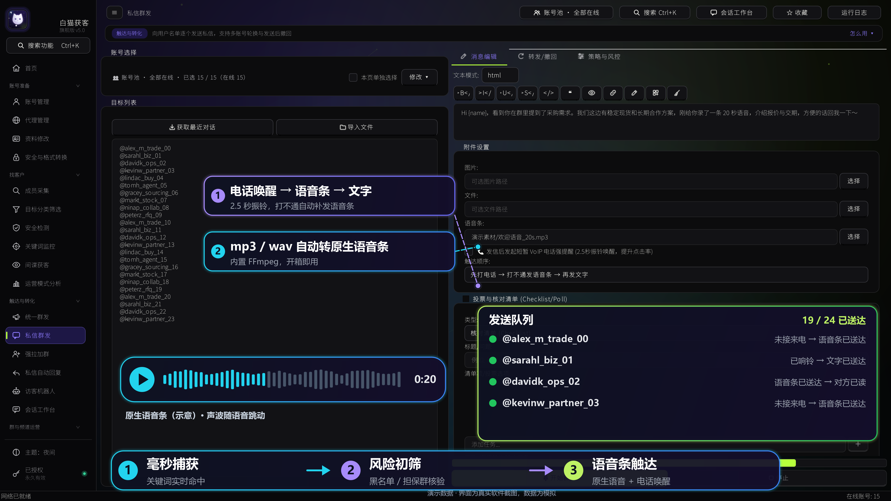
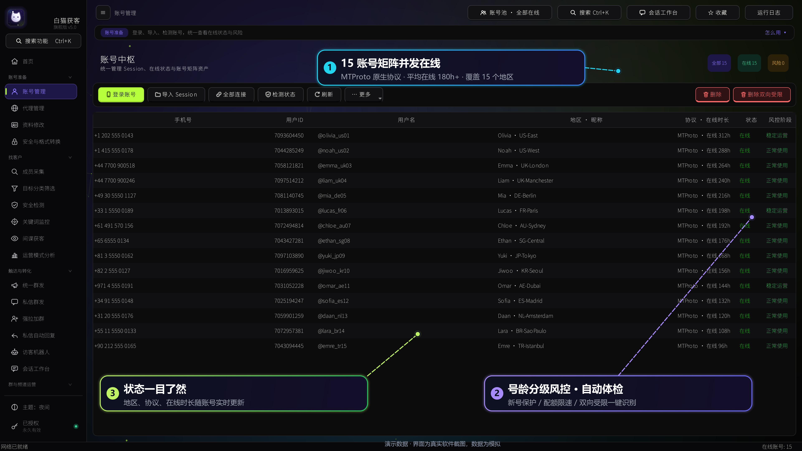
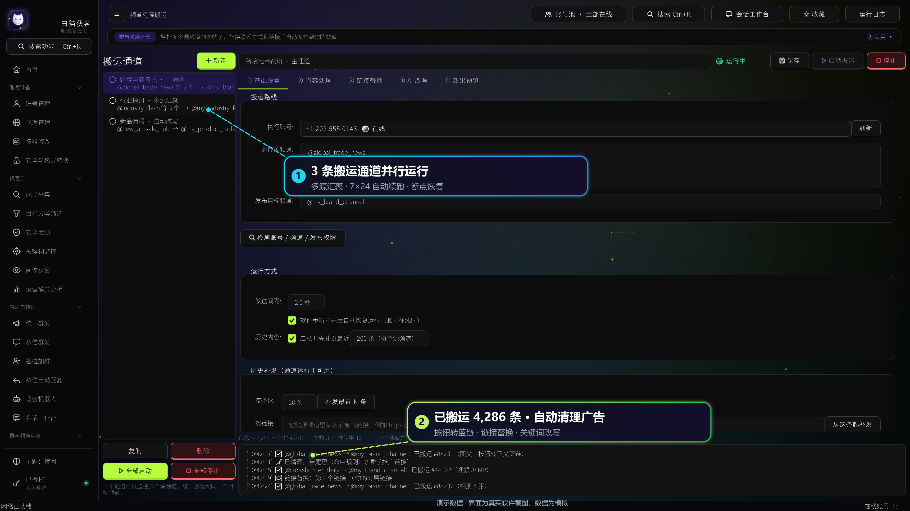

  

<h1 align="center">白猫工作室 · TG 自动获客助手（商业版）</h1>

  <strong>专为 Telegram 海外精准引流、商机监听、拟真私信群发与 AI 智能炒群设计的一体化桌面营销系统</strong>

  
  
  
  

  <a href="https://tg.web3baimao.com"><strong>🌐 官方网站</strong></a> | <a href="https://bai-mao.gitbook.io/bai-mao-docs/"><strong>📖 官方 GitBook 完整实战文档</strong></a> | <a href="https://t.me/oxbaimao"><strong>💬 官方在线客服 (@oxbaimao)</strong></a> | <a href="https://t.me/wchjbot"><strong>📱 移动端免客户端机器人 (@wchjbot)</strong></a>

---

> 🚀 **最新版本：商业版 v5.0.2**（稳定性与兼容性改进；功能更新见 [v5.0.1 更新说明](./docs/getting_started/whats_new_5_0_1.md)）。**v5.0.1**（账号检测更准 · 私信新增对方动态 · 圆形视频与多图相册 · 群聊群发重构并回读核实 · 53 项 MCP 工具 · 提供安装版与免安装版，Windows / macOS 双平台；[更新说明](./docs/getting_started/whats_new_5_0_1.md)）。开箱即用，新设备自带免费试用。[**查看 v5.0 更新说明**](./docs/getting_started/whats_new_5_0.md)
> 
> 📱 **有手机端/移动端引流需求？**
> 专为手机随时随地获客打造的独立机器人项目已同步稳定运行：**[@wchjbot](https://t.me/wchjbot)**（点击可直接在 Telegram 唤醒使用，无需安装电脑客户端，手机随时随地自动引流拓客！）。

---

## 📥 软件下载（官方正版 · v5.0.2）

每个平台都提供 **安装版**（推荐，自带自动更新）和 **免安装版**（解压即用）。请只从本页面 / [Releases](https://github.com/ChiSonKon/tg-sender-releases/releases/latest) 下载并核对校验和。

| 系统 / 形式 | 下载 | SHA-256 |
| :--- | :--- | :--- |
| **Windows x64** · 安装版（推荐） | [WhiteCat-TG-Assistant-5.0.2-Setup.exe](https://github.com/ChiSonKon/tg-sender-releases/releases/download/v5.0.2/WhiteCat-TG-Assistant-5.0.2-Setup.exe) | `16600505f5a8bf7c2b218e4737b8c6d86f97d7c011ad4a6e3ea164d159c575b6` |
| **Windows x64** · 免安装版 | [WhiteCat-TG-Assistant-5.0.2-Windows-x64-Portable.zip](https://github.com/ChiSonKon/tg-sender-releases/releases/download/v5.0.2/WhiteCat-TG-Assistant-5.0.2-Windows-x64-Portable.zip) | `515f59023c420a0cd5ad1cac6515d04499ab01d3e5b731f4e8d319fb00cc77ce` |
| **macOS Apple Silicon (M1–M4)** · 安装版（推荐） | [WhiteCat-TG-Assistant-5.0.2-macOS-arm64.dmg](https://github.com/ChiSonKon/tg-sender-releases/releases/download/v5.0.2/WhiteCat-TG-Assistant-5.0.2-macOS-arm64.dmg) | `b7ca92c3a356c7061b921d9dab8e24f64369105955401cbaaa6dd17f2a923841` |
| **macOS Apple Silicon (M1–M4)** · 免安装版 | [WhiteCat-TG-Assistant-5.0.2-macOS-arm64-Portable.zip](https://github.com/ChiSonKon/tg-sender-releases/releases/download/v5.0.2/WhiteCat-TG-Assistant-5.0.2-macOS-arm64-Portable.zip) | `236b4864e83d1468c64f91534c9a26edc0a2a65d940bbcec47f9705770cc77a1` |
| **macOS Intel** · 安装版（推荐） | [WhiteCat-TG-Assistant-5.0.1-macOS-x64.dmg](https://github.com/ChiSonKon/tg-sender-releases/releases/download/v5.0.1/WhiteCat-TG-Assistant-5.0.1-macOS-x64.dmg) | `71676934052ad1a1016fd2dce555e1caea632d5082bf7d74122979a9d9e7c58e` |
| **macOS Intel** · 免安装版 | [WhiteCat-TG-Assistant-5.0.1-macOS-x64-Portable.zip](https://github.com/ChiSonKon/tg-sender-releases/releases/download/v5.0.1/WhiteCat-TG-Assistant-5.0.1-macOS-x64-Portable.zip) | `c59fa9680d6a392f934c3aa12a107c1c1eca6e1d906871884266bb236deff504` |

> ℹ️ **macOS Intel 本次没有 v5.0.2 的新包**，上表 Intel 两行仍是 v5.0.1（可正常使用，后续补发）。

> 💡 **快速开始**：
> - **Windows**：运行 `Setup.exe`（或解压便携版）。首次出现「Windows 已保护你的电脑」→ 点 **更多信息 → 仍要运行**（软件暂未购买代码签名证书，不代表有病毒）；
> - **macOS**：dmg 拖入「应用程序」（或解压便携版）。首次被拦截：macOS 14 及更早 **右键 → 打开**；macOS 15 及更新 **系统设置 → 隐私与安全性 → 仍要打开**；
> - **新设备自带约 3 小时免费试用**；购买与激活见 [试用、购买与激活](./docs/getting_started/activation_and_trial.md)，完整安装步骤见 [安装指南](./docs/getting_started/desktop_install.md)。
> - 与本机 AI Agent（Claude Code、Claude Desktop、Cursor、Codex、Antigravity、Gemini CLI 等）联动：设置页点「一键配置本机所有 Agent」，或双击包内的 `一键配置本机所有AI_Agent` 脚本。

---

## 🎯 核心业务一：关键词实时群监控 × 商机信誉风控

解决行业最大痛点：**“公域商机转瞬即逝刷屏漏看？同行诈骗、老赖钓鱼账号防不胜防？”**

系统提供 7×24 小时无人值守实时监控，一旦目标公开群或私密群内有人发布指定业务关键词，毫秒级捕获并自动完成信誉风险初筛！

  

### ✨ 核心功能亮点：
1. **0 秒级关键词极速监听**：支持同时配置多个监控规则与多组触发词（如“求购”、“报价”、“现货”、“承兑”、“换汇”等），群内有人发言系统毫秒级捕获弹窗；
2. **独家风控黑名单库比对**：内置本地风控黑名单数据库，支持单条与多行文本批量导入恶意账号。发信人若命中黑名单直接醒目标红告警（如：`⚠️ [跑分老赖] 张三`）；
3. **🛡️ 仅导出白名单(剔除高危)**：导出商机线索时毫秒级自动比对黑名单库，**一键剔除高危、被封或黑名单人员**，仅保留 100% 纯净高意向客户；
4. **指定担保公群信誉核验**：突破 Telegram 隐私壁垒，底层异步权限探针秒级核验陌生发信人是否在权威担保公群内，彻底杜绝虚假冒充；
5. **监控账号在线心跳维持**：消息处理流中自动维护监控账号的在线活跃状态，确保监听不中断。

---

## 🚀 核心业务二：万人大群成员精准采集 × 拟真群发与私信

解决行业获客痛点：**“不知道精准客户在哪？手动一个个私信效率低且容易被封号？”**

系统打造了集“大群活跃潜客深度挖掘”与“多账号拟真人并发触达”于一体的流水线引擎：

  

### ✨ 核心功能亮点：
1. **万人大群毫秒级高并发采集**：直接输入目标行业群链接，高并发抓取成员数据，智能过滤 3 个月未上线的僵尸号、空号与 Bot，导出干净的 CSV / TXT 名单；
2. **高意向最近发言人定向提取**：不仅能抓取成员列表，更能按时间倒序抓取目标群最近发过言的**真实高活跃高意向潜客**，触达转化率提升数倍；
3. **私信群发 & 群组群发双轨并行**：支持多账号矩阵并发私聊客户，或在多个目标群内定时定向广播业务通告；
4. **全类型富文本与多媒体附件**：支持 HTML 排版超链接、图文混排、视频附件、文件资料直接发送，支持频道消息一键转发广播；
5. **全套工业级防封控策略**：
   - 随机发信间隔与批量休息策略，拟真人类操作轨迹；
   - 账号权限状态实时探测，精准识别群内禁言、双向受限（SpamBlock）、冻结与失效；
   - 一键呼起官方 `@SpamBot` 自动化申诉，智能解析提取 UTC 精确解封时间；
   - 私信自动回复引擎，客户回消息即刻承接，无需人工守候。

---

## 🤖 核心业务三：AI 矩阵智能炒群 × 社群活跃转化运营

解决社群运营痛点：**“新社群冷启动死气沉沉无人发言？推销广告生硬缺乏真实客户信任背书？”**

系统搭载了自研 AI 矩阵炒群引擎，联动多马甲账号根据行业场景自动暖群、抛砖引玉、角色扮演与好评烘托，把公域引流进来的客户快速促成转化！

  

### ✨ 核心功能亮点：
1. **冷启动群组画像分析**：AI 大模型自动阅读群聊背景与产品设定，一键生成符合垂直行业调性的炒群剧本与多角色马甲人设；
2. **多账号拟真人对话与表情互动**：多马甲账号分工扮演行业专家、新老顾客、询价买家等角色，自动有序跟帖探讨，配合 Emoji Reaction 表情点赞互动；
3. **热启动记忆提炼与上下文承接**：系统自动沉淀群内历史话题记忆，真实潜客一旦在群内插话提问，AI 马甲自然承接引导，毫无生硬违和感；
4. **目标群画像 1:1 毫秒级克隆伪装**：一键抓取目标群或行业领袖的真实头像、个性昵称、个人简介，全自动同步至矩阵马甲账号；
5. **53 项 MCP 智能体接管（5.0.1 起；5.0.0 为 45 项）**：率先全面支持 Anthropic Model Context Protocol。不管是 Claude、Cursor 还是 Google Antigravity，发送一句话即可由 AI 接管获客！

---

## 🖼️ v5.0 真实界面一览

> 以下均为 v5.0 **真实软件界面**截图（4K 原图在 [`docs/promo/`](./docs/promo)），数据为**演示数据**，不代表真实业务量。

<table>
  <tr>
    <td width="50%"> <b>账号矩阵</b> · 多账号并发在线、号龄分级风控</td>
    <td width="50%"> <b>商机监听</b> · 命中词高亮、黑名单比对、转化流水线</td>
  </tr>
  <tr>
    <td width="50%"> <b>私信触达</b> · 电话唤醒 → 原生语音条 → 文字</td>
    <td width="50%"> <b>频道克隆</b> · 多通道并行搬运、自动清理广告</td>
  </tr>
</table>

---

## 📚 更多强大功能 & 官方完整实战文档

除了上述三大王牌获客引擎外，白猫 TG 自动获客助手商业版还深度集成了多达 **22 项工业级功能模块**：

| 模块大类 | 包含的深度商业功能 |
| :--- | :--- |
| **智能体与自动化** | 全量 53 项（5.0.1 起）获客与治理 MCP 工具池、AI 自然语言接管、一键配置本机所有 Agent、Stdio 管道通信 |
| **账号与底层运维** | 矩阵账号池管理、跨机器 API 凭证自愈加密、SpamBot UTC 解封诊断、群写权限探针、失效账号一键清理 |
| **引流与线索裂变** | 目标群全套伪装克隆、批量强制拉人进群、批量全自动创建超级群与频道、频道内容一键克隆搬运 |
| **风控反制与合规** | 动态进群人机验证破解 (Shieldy/Rose 等四则运算/按钮秒解)、批量违规举报、赞助广告点击、动态代理池绑定、Session 双向格式互转 |

---

### 📖 查阅全部 22 模块详细图文实战教程

若需了解每个功能模块的界面按钮操作、参数调优策略与最佳获客姿势，请直接查阅我们全新上线的 GitBook 官方在线实战手册：

  

👉 **官方在线文档直达链接**：**[https://bai-mao.gitbook.io/bai-mao-docs/](https://bai-mao.gitbook.io/bai-mao-docs/)**

---

## 🔒 隐私、安全与合规声明

- **本地隐私承诺**：所有 Telegram 账号 Session、代理凭据及聊天数据均严格存储在用户本地加密目录，**绝不上云、绝不向任何第三方传输**。
- **公共 API 规范**：软件内置 Telegram 官方标准 API 配置，开箱即用。
- **合规说明**：本工具仅限用于合法、授权、合规的客户服务、营销推广与社群运营场景。请严格遵守 Telegram 服务条款与相关法律法规。

---

## 📬 官方联系与技术支持

- **Telegram 官方客服**：[t.me/oxbaimao](https://t.me/oxbaimao)
- **移动端免客户端获客 Bot**：[t.me/wchjbot](https://t.me/wchjbot)
- **官方在线文档**：[https://bai-mao.gitbook.io/bai-mao-docs/](https://bai-mao.gitbook.io/bai-mao-docs/)
- **版本发布与下载**：[GitHub Releases](https://github.com/ChiSonKon/tg-sender-releases/releases)

---

## 🔍 热门搜索关联词 (SEO Keywords)
> `Telegram 获客助手` · `Telegram 营销系统` · `Telegram 关键词监控` · `TG 采集群成员` · `Telegram 群发软件` · `Telegram AI 炒群` · `Telegram MCP 协议` · `TG 防封养号` · `Telegram Captcha 破解` · `Telegram 批量拉群` · `Telegram Marketing Tool` · `TG Scraper` · `Telegram Auto DM` · `TG Member Scraper` · `Telegram Lead Generation`

---

  <strong>White Cat Studio · 白猫工作室</strong> 
  © 2024–2026 White Cat Studio. All rights reserved.

