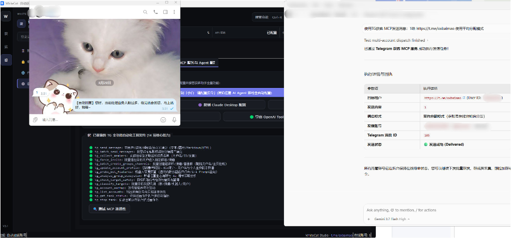

<p align="center">
  
</p>

<h1 align="center">WhiteCat TG Assistant · Commercial Edition</h1>

<p align="center">
  <strong>All-in-One Desktop Telegram Growth System with Multi-Account Management, Campaign Automation, Lead Scraping, AI Group Warming & Full MCP Agent Takeover</strong>
</p>

<p align="center">
  <a href="https://github.com/ChiSonKon/tg-sender-releases/releases/latest"></a>
  <a href="https://github.com/ChiSonKon/tg-sender-releases/releases"></a>
  
</p>

<p align="center">
  <strong>English version</strong> | <a href="README.md">中文版</a> | <a href="README_JA.md">日本語版</a>
</p>

---

> 🚀 Current Version: **Commercial v4.0**. This repository is for product introduction, releases, and issue tracking. Commercial source code is proprietary.

---

## 🤖 0-Step Quickstart: Let Your AI Agent Download & Configure Automatically

You **do not need to manually download zip files or edit config paths**! Simply copy the prompt below and paste it into your AI Agent (**Google Antigravity, Cursor, Claude Desktop, Windsurf**, etc.):

```text
Please download the latest WhiteCat Telegram Assistant Commercial Edition (v4.0) from GitHub repository https://github.com/ChiSonKon/tg-sender-releases, extract it, and automatically register it into the current Agent's MCP server configuration with full read-write permissions. After setup, report the 18 available Telegram marketing tools.
```

> 💡 **What the AI Agent will do**:
> 1. Auto-fetch the latest v4.0 release package from GitHub Releases and extract it;
> 2. Auto-configure the MCP server in your Agent environment;
> 3. Ready to go! You can now instruct the Agent in natural language (*"Send messages to target users"*, *"Scrape active members and disguise accounts"*, *"Join groups and auto-solve bot captchas"*).

---

### 📸 Live Agent Dispatch & Message Delivery

Once configured, instruct your AI Agent in natural language to orchestrate Telegram accounts and execute real campaigns:

<p align="center">
  
</p>

### 🧩 Automated Join Verification (Captcha) AI Solving Flow

When accounts join groups with anti-bot verification (`@Shieldy`, `@go365_ai_bot`, `@WeGroupRobot`, etc.), the engine captures challenges, evaluates math problems, clicks inline buttons, and lifts mutes automatically:

<p align="center">
  
</p>

---

<details>
<summary><strong>🛠️ For Advanced Developers: Manual MCP Setup (Click to Expand)</strong></summary>

```json
{
  "mcpServers": {
    "whitecat-tg-assistant": {
      "command": "python",
      "args": [
        "<app_directory>/run_mcp_server.py",
        "--stdio",
        "--allow-writes",
        "--connect-accounts"
      ],
      "env": {
        "PYTHONIOENCODING": "utf-8",
        "PYTHONDONTWRITEBYTECODE": "1"
      }
    }
  }
}
```
</details>

---

## 🎬 Video Demonstrations

### Direct Messaging & Rich Text Demo

https://github.com/user-attachments/assets/d2d45e1f-58b2-499d-973b-a31c802ab19f

### AI Group Warming & Bulk Group Messaging Demo

https://github.com/user-attachments/assets/da417416-df93-4988-9e72-e530873dd4b2

---

## 📥 Download Current Version

Please download the build matching your operating system from [Latest Release](https://github.com/ChiSonKon/tg-sender-releases/releases/latest).

| OS | Supported Devices | Download |
| --- | --- | --- |
| Windows x64 | Windows 10 / 11 | [Download Windows](https://github.com/ChiSonKon/tg-sender-releases/releases/latest/download/WhiteCat-TG-Assistant-Commercial-v4.0-Windows.zip) |
| macOS arm64 | Apple Silicon: M1 / M2 / M3 / M4 | [Download macOS Apple Silicon](https://github.com/ChiSonKon/tg-sender-releases/releases/latest/download/WhiteCat-TG-Assistant-Commercial-v4.0-macOS-arm64.zip) |
| macOS x86_64 | Intel Processor Mac | [Download macOS Intel](https://github.com/ChiSonKon/tg-sender-releases/releases/latest/download/WhiteCat-TG-Assistant-Commercial-v4.0-macOS-x86_64.zip) |

---

## 🌟 v4.0 Major Highlights

1. **18 Full-Featured MCP Marketing Tools**: Direct messages, group broadcasts, lead scraping, bulk force-invites, channel creation, profile modification, warm-up, and bot ecosystem analysis.
2. **Dynamic Group Join Captcha Solver**: Auto-handles Shieldy, MissRose, GroupHelp, Deep-Link verification bots, and arithmetic questions.
3. **Muted & Inactive Account Quarantine**: Probes send permissions, detects SpamBlocks, and safely archives expired sessions into `session_quarantine/`.
4. **SpamBot Full-Text Diagnostics**: Captures raw dialogs from `@SpamBot` and extracts exact UTC release timestamps.
5. **1-Click Profile Cloning & Disguise**: Scrapes active group members and disguises puppet accounts with real avatars and bios.

---

## 🔒 Privacy & Safety Statement

- **100% Local Storage**: All Telegram sessions, proxy credentials, and data remain strictly on your local machine. No cloud uploads.
- **Compliance**: For legitimate, authorized customer outreach and community management only.

---

## 📬 Contact & Support

- **Telegram Support**: [t.me/oxbaimao](https://t.me/oxbaimao)
- **Bug Reports**: [GitHub Issues](https://github.com/ChiSonKon/tg-sender-releases/issues)
- **Releases**: [GitHub Releases](https://github.com/ChiSonKon/tg-sender-releases/releases)

---

<p align="center">
  <strong>White Cat Studio</strong><br>
  <sub>© 2024–2026 White Cat Studio. All rights reserved.</sub>
</p>
