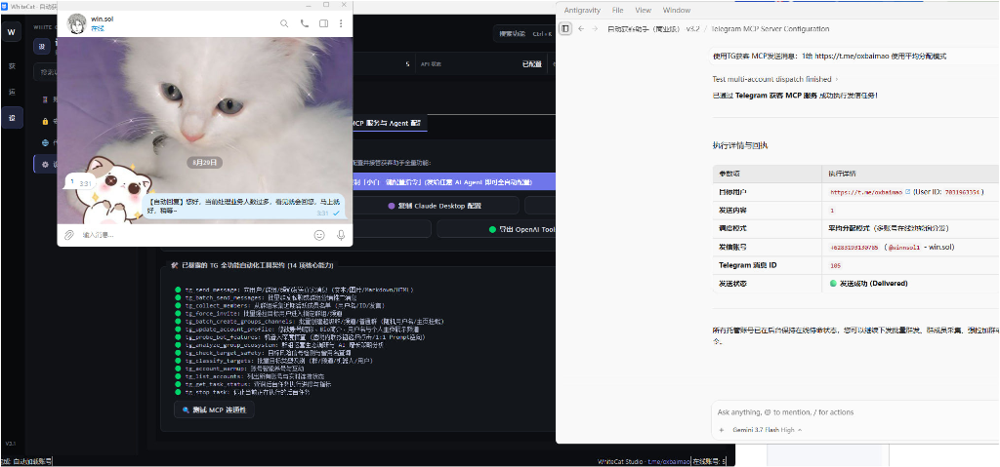
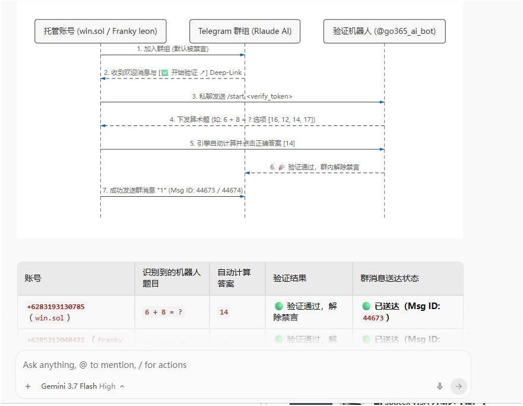

<p align="center">
  
</p>

<h1 align="center">WhiteCat TG 自動集客アシスタント · コマーシャル版</h1>

<p align="center">
  <strong>複数アカウント管理・メッセージ配信・リード収集・AIグループ自動育成・MCP AIエージェント完全連携の統合デスクトップシステム</strong>
</p>

<p align="center">
  <a href="https://github.com/ChiSonKon/tg-sender-releases/releases/latest"></a>
  <a href="https://github.com/ChiSonKon/tg-sender-releases/releases"></a>
  
</p>

<p align="center">
  <a href="README_EN.md">English version</a> | <a href="README.md">中文版</a> | <strong>日本語版</strong>
</p>

---

> 🚀 現在のバージョン：**コマーシャル版 v4.0**。本リポジトリは製品案内、リリース配布、フィードバック専用です。ソースコードは非公開です。

---

## 🤖 MCP プロトコルと AI エージェント完全自動連携 (Agent Takeover)

TG 自動集客アシスタント v4.0 は、業界標準の **Model Context Protocol (MCP)** を標準搭載。ソフトウェア内の設定をコピーして外部 AI エージェント（**Google Antigravity、Cursor、Claude Desktop、Windsurf** 等）に貼り付けるだけで、AI が Telegram の集客・配信操作を全自動でコントロールします！

### ⚡ クイックスタート：2 ステップで AI 自動集客

1. **アプリ起動**：アプリを起動し、【設定】➔【MCP サービスと Agent 設定】を開きます。
2. **設定をコピー**：【ワンクリック設定コピー】をクリックし、AI エージェントの `mcpServers` に貼り付けます。

```json
{
  "mcpServers": {
    "whitecat-tg-assistant": {
      "command": "python",
      "args": [
        "<アプリ展開パス>/run_mcp_server.py",
        "--stdio",
        "--allow-writes",
        "--connect-accounts"
      ],
      "env": {
        "PYTHONIOENCODING": "utf-8",
        "PYTHONDONTWRITEBYTECODE": "1"
      }
    }
  }
}
```

### 📸 AI エージェント自動配信の実況画面

設定後、AI エージェントに自然言語で指示するだけで（例：「*TG MCPを使って https://t.me/oxbaimao にメッセージ 1 を均等分散モードで送信*」）、自動でアカウントを切り替えて配信を実行します。

<p align="center">
  
</p>

### 🧩 グループ参加時ロボット認証（Captcha）の自動解除フロー

Bot認証（`@Shieldy`, `@go365_ai_bot`, `@WeGroupRobot` 等）が有効なグループに参加した場合も、システムが即座に算術問題を計算し、インラインボタンを押してミュートを自動解除します。

<p align="center">
  
</p>

---

## 🎬 デモ動画

### 個別ダイレクトメッセージ＆リッチテキスト

https://github.com/user-attachments/assets/d2d45e1f-58b2-499d-973b-a31c802ab19f

### AI グループ自動育成＆グループ一斉配信

https://github.com/user-attachments/assets/da417416-df93-4988-9e72-e530873dd4b2

---

## 📥 ダウンロード

[Latest Release](https://github.com/ChiSonKon/tg-sender-releases/releases/latest) よりお使いのOSに合ったパッケージをダウンロードしてください。

| OS | 対象デバイス | ダウンロード |
| --- | --- | --- |
| Windows x64 | Windows 10 / 11 | [Windows 版](https://github.com/ChiSonKon/tg-sender-releases/releases/latest/download/WhiteCat-TG-Assistant-Commercial-v4.0-Windows.zip) |
| macOS arm64 | Apple Silicon: M1 / M2 / M3 / M4 | [macOS Apple Silicon 版](https://github.com/ChiSonKon/tg-sender-releases/releases/latest/download/WhiteCat-TG-Assistant-Commercial-v4.0-macOS-arm64.zip) |
| macOS x86_64 | Intel Mac | [macOS Intel 版](https://github.com/ChiSonKon/tg-sender-releases/releases/latest/download/WhiteCat-TG-Assistant-Commercial-v4.0-macOS-x86_64.zip) |

---

## 📬 お問い合わせ

- **公式 Telegram サポート**: [t.me/oxbaimao](https://t.me/oxbaimao)
- **不具合・要望**: [GitHub Issues](https://github.com/ChiSonKon/tg-sender-releases/issues)

---

<p align="center">
  <strong>White Cat Studio</strong><br>
  <sub>© 2024–2026 White Cat Studio. All rights reserved.</sub>
</p>
