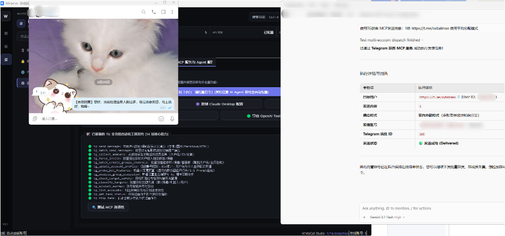
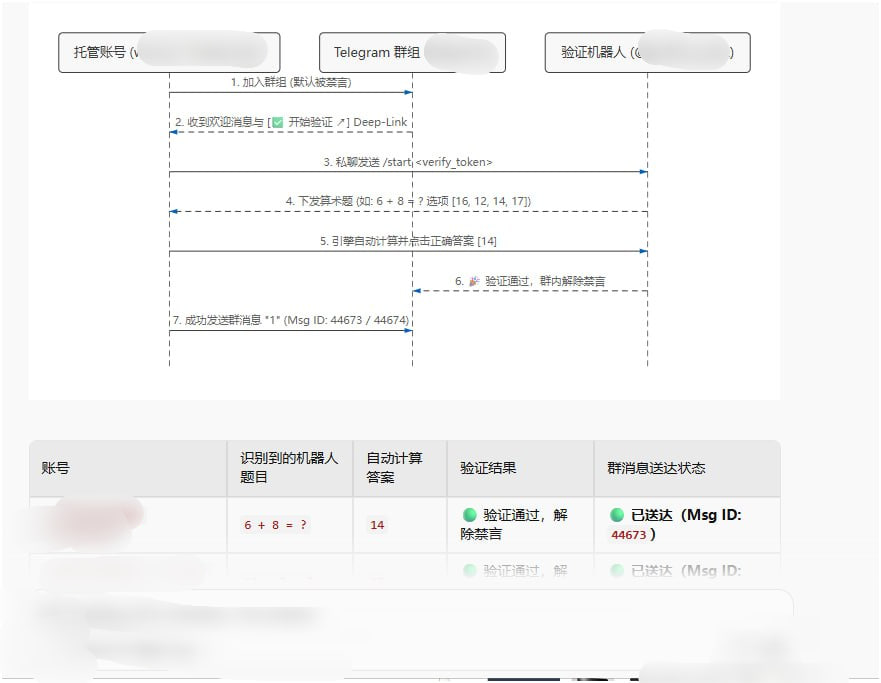

<p align="center">
  
</p>

<h1 align="center">WhiteCat TG 自動集客アシスタント · コマーシャル版</h1>

<p align="center">
  <strong>複数アカウント管理・メッセージ配信・リード収集・AIグループ自動育成・MCP AIエージェント完全連携の統合デスクトップシステム</strong>
</p>

<p align="center">
  <a href="https://github.com/ChiSonKon/tg-sender-releases/releases/latest"></a>
  <a href="https://github.com/ChiSonKon/tg-sender-releases/releases"></a>
  
</p>

<p align="center">
  <a href="README_EN.md">English version</a> | <a href="README.md">中文版</a> | <strong>日本語版</strong>
</p>

---

> 🚀 現在のバージョン：**コマーシャル版 v5.0.0**（ネイティブコンパイル・新ライセンス/決済・新UI・MCP 45 ツール（v5.0.1 で 53 ツールに拡張予定）・macOS 対応・インストーラー版とポータブル版）。新しい端末には約 3 時間の無料トライアルが付きます。詳細は [v5.0 リリースノート](./docs/getting_started/whats_new_5_0.md)（中国語）。

---

## ⚡ 最速セットアップ：ローカル AI エージェント一括自動設定（拒否トラブル完全回避・100%成功）

### 方法 A（最もおすすめ · ダブルクリックするだけ）：同梱の自動設定スクリプト
リリースパッケージをダウンロードして展開後、**フォルダ内のスクリプトをダブルクリックして実行するだけ**です：
- **Windows ユーザー**：`一键配置本机所有AI_Agent.bat` をダブルクリック
- **macOS ユーザー**：`一键配置本机所有AI_Agent.command` をダブルクリック

> 🚀 **全自動検出と安全マージ**：
> - Python のインストール不要で、PC にインストールされている主要 AI エージェント（**OpenAI Codex、Claude Desktop、Cursor、Google Antigravity、Windsurf、VS Code Cline / Roo-Code**）を自動検出；
> - 既存の設定を自動バックアップしながら、MCP サーバー設定を安全に統合；
> - **「Codex や Claude などのエージェントにプロンプトを送ってもシステム設定の変更を拒否される」問題を完全に回避できます！**

---

### 方法 B（アプリ内設定）：設定画面からワンクリック登録
獲客アシスタント本体をすでに起動している場合：
1. 【**設定**】➔【**🔌 MCP サービスと Agent 設定**】タブを開きます；
2. 【**⚡ ローカルの全 AI エージェントを一括自動検出・設定**】ボタンをクリック；
3. ポップアップで検出結果と設定パスを確認できます。対象エージェントを再起動またはリロードすれば、自動化・コミュニティ統治ツール（v5.0.0 は 45 種類、v5.0.1 から 53 種類）が即座に使用可能になります！

---

### 方法 C（プロンプトによる導入）：エージェントに完全なファイル・ターミナル権限がある場合
ご利用のエージェントがローカルファイルの編集やダウンロードに対応している場合は、以下のプロンプトをそのまま送信することも可能です：

```text
GitHub リポジトリ https://github.com/ChiSonKon/tg-sender-releases から最新の Telegram 集客アシスタント商用版 (v5.0) を自動ダウンロード・展開し、現在の MCP サーバー設定にフル権限で登録してください。完了後、利用可能な45種類の集客・コミュニティ統治機能を報告してください。
```

> 💡 **エージェントが自動で行うこと**:
> 1. GitHub Releases よりお使いのOSに最適な最新版を自動取得・展開；
> 2. 現在の AI 環境に MCP 集客サービスを自動登録；
> 3. 準備完了！あとは「ターゲットにメッセージを送信して」「グループ参加認証を自動解除して」「キーワード監視を開始して」と指示するだけです。

---

### 📸 AI エージェント自動配信の実況画面

設定後、AI エージェントに自然言語で指示するだけで、自動でアカウントを切り替えて配信を実行します。

<p align="center">
  
</p>

### 🧩 グループ参加時ロボット認証（Captcha）の自動解除フロー

Bot認証（`@Shieldy`, `@go365_ai_bot`, `@WeGroupRobot` 等）が有効なグループに参加した場合も、システムが即座に算術問題を計算し、インラインボタンを押してミュートを自動解除します。

<p align="center">
  
</p>

---

<details>
<summary><strong>🛠️ 開発者向け：手動 MCP 設定（クリックして展開）</strong></summary>

```json
{
  "mcpServers": {
    "whitecat-tg-assistant": {
      "command": "python",
      "args": [
        "<アプリ展開パス>/run_mcp_server.py",
        "--stdio",
        "--allow-writes",
        "--connect-accounts"
      ],
      "env": {
        "PYTHONIOENCODING": "utf-8",
        "PYTHONDONTWRITEBYTECODE": "1"
      }
    }
  }
}
```
</details>

---

## 🎬 デモ動画

### 個別ダイレクトメッセージ＆リッチテキスト

https://github.com/user-attachments/assets/d2d45e1f-58b2-499d-973b-a31c802ab19f

### AI グループ自動育成＆グループ一斉配信

https://github.com/user-attachments/assets/da417416-df93-4988-9e72-e530873dd4b2

---

## 📥 ダウンロード

[Latest Release](https://github.com/ChiSonKon/tg-sender-releases/releases/latest) よりお使いのOSに合ったパッケージをダウンロードしてください。

| OS | 対象デバイス | ダウンロード | SHA-256 チェックサム |
| :--- | :--- | :--- | :--- |
| **Windows x64** · インストーラー（推奨） | [WhiteCat-TG-Assistant-5.0.0-Setup.exe](https://github.com/ChiSonKon/tg-sender-releases/releases/download/v5.0.0/WhiteCat-TG-Assistant-5.0.0-Setup.exe) | `e20f7627ce518e0f4d266a7c442e5939d8fc2ec366d7ffe8a5e40f1ba2abf9d0` |
| **Windows x64** · ポータブル | [WhiteCat-TG-Assistant-5.0.0-Windows-x64-Portable.zip](https://github.com/ChiSonKon/tg-sender-releases/releases/download/v5.0.0/WhiteCat-TG-Assistant-5.0.0-Windows-x64-Portable.zip) | `9e4a0c7a377d27649c0d51b9246489d6884445d5877e9cf29547713d4cc7709e` |
| **macOS Apple Silicon** · DMG（推奨） | [WhiteCat-TG-Assistant-5.0.0-macOS-arm64.dmg](https://github.com/ChiSonKon/tg-sender-releases/releases/download/v5.0.0/WhiteCat-TG-Assistant-5.0.0-macOS-arm64.dmg) | `2a43fa8e2508a0425e4a72fa1e4df413372459fb98b421e5dcd68a806a9b3ffa` |
| **macOS Apple Silicon** · ポータブル | [WhiteCat-TG-Assistant-5.0.0-macOS-arm64-Portable.zip](https://github.com/ChiSonKon/tg-sender-releases/releases/download/v5.0.0/WhiteCat-TG-Assistant-5.0.0-macOS-arm64-Portable.zip) | `c03e446345039f94a82bfcad4d1c58c98fb8d2eb89d26e3e2bf60f0a8b7dad31` |
| **macOS Intel** · DMG（推奨） | [WhiteCat-TG-Assistant-5.0.0-macOS-x64.dmg](https://github.com/ChiSonKon/tg-sender-releases/releases/download/v5.0.0/WhiteCat-TG-Assistant-5.0.0-macOS-x64.dmg) | `83390ade3c6de253dfa9f721bb954ccb12e2619f6b4bba8722136f25aa519a98` |
| **macOS Intel** · ポータブル | [WhiteCat-TG-Assistant-5.0.0-macOS-x64-Portable.zip](https://github.com/ChiSonKon/tg-sender-releases/releases/download/v5.0.0/WhiteCat-TG-Assistant-5.0.0-macOS-x64-Portable.zip) | `a0af3ffe9123b09291d7a3c23f597c260377998694435ae79af0b11f3cff232d` |

---

## 🌟 v4.1 主なアップデート内容

1. **MCP ツール 53 種類（v5.0.1 から。v5.0.0 は 45 種類）**:
   - メッセージ配信、グループ一斉送信、アクティブメンバー抽出、強制招待、チャンネル作成、自動返信エンジン、AIグループ活性化、チャンネル複製、キーワード監視、リスクブラックリスト管理、プロキシプール、セッション変換など業務を100%完全制御。
   - `一键配置本机所有AI_Agent.bat` またはアプリ内ワンクリックで OpenAI Codex、Claude Desktop、Cursor、Google Antigravity、Windsurf、VS Code Roo-Code に即時登録可能。
2. **商談信用検証＆ホワイトリスト安全抽出（業界初）**:
   - キーワード監視で「ホワイトリストのみ抽出（高リスク除外）」を新搭載。ミリ秒単位でブラックリストと照合し、悪質ユーザーや詐欺師を自動除外。
3. **API クレデンシャルの自動修復と暗号化**:
   - 商用版専用の Telegram API 設定を内包し、PC 移行時の未設定エラーを完全解消。端末指紋の変化を検知して自動修復・再暗号化。
4. **指定保証グループメンバー即時判定**:
   - 未知の送信者が指定グループの正規メンバーかを非同期検証し、なりすまし詐欺を防止。
5. **グループ参加ロボット認証（Captcha）の自動解除**:
   - Shieldy、MissRose、GroupHelp、Go365、WeGroupRobot の算術問題や Deep-Link 認証を完全自動化。
6. **発信権限プローブと無効アカウントの隔離アーカイブ**:
   - 送信権限を診断し、制限されたセッションを `session_quarantine/` へ安全退避。
7. **SpamBot 制限状態と正確な解除日時（UTC）の解析**:
   - `@SpamBot` の対話全文から解除日時を構造化抽出。
8. **監視アカウントのオンラインハートビート維持**:
   - 定期的なアクティブ更新により意図しない切断を防止。

---

## 📬 お問い合わせ

- **公式 Telegram サポート**: [t.me/oxbaimao](https://t.me/oxbaimao)
- **不具合・要望**: [GitHub Issues](https://github.com/ChiSonKon/tg-sender-releases/issues)

---

<p align="center">
  <strong>White Cat Studio</strong><br>
  <sub>© 2024–2026 White Cat Studio. All rights reserved.</sub>
</p>
