# 白猫工作室 TG 自动获客助手 · 全功能商业实战手册 (v4.1)

  
  
  
  

  <strong>专为 Telegram 海外精准获客、私域矩阵引流、社群智能化运营与 AI Agent 协同调度量身打造的工业级实战全书。</strong> 
  <em>本文档涵盖客户端内全部 22 大功能模块的界面图解、要素说明、标准操作步骤与高阶工业级防封秘籍。</em>

---

## 📑 快速目录索引 (Navigation Index)

### 📂 第一篇：底座与环境设置 (4 大模块)
- [01. 账号管理 (Account Hub)](#01-设置--账号管理)
- [02. 代理管理 (Proxy Manager)](#02-设置--代理管理)
- [03. 安全与格式转换 (Format Converter)](#03-设置--安全与格式转换)
- [04. 系统配置与 MCP 智能体 (System & MCP)](#04-设置--系统配置与-mcp-智能体)

### 📂 第二篇：海外精准获客与流量裂变 (10 大模块)
- [05. 成员采集 (Member Scraping)](#05-获客--成员采集)
- [06. 关键词监控 (Keyword Monitor)](#06-获客--关键词监控)
- [07. 统一群发 (Unified Send)](#07-获客--统一群发)
- [08. 私信群发 (Private Send)](#08-获客--私信群发)
- [09. 强拉加群 (Force Invite)](#09-获客--强拉加群)
- [10. 批量加群与养号 (Warmup)](#10-获客--批量加群与养号)
- [11. 资料修改 (Profile Manager)](#11-获客--资料修改)
- [12. 安全检测 (Security Check)](#12-获客--安全检测)
- [13. 目标分类筛选 (Target Classifier)](#13-获客--目标分类筛选)
- [14. 批量举报 (Batch Report)](#14-获客--批量举报)

### 📂 第三篇：社群活跃与 AI 自动化运营 (8 大模块)
- [15. AI 炒群 (AI Hype Engine)](#15-运营--ai-炒群)
- [16. 间谍获客 (Spy Engine)](#16-运营--间谍获客)
- [17. 访客机器人 (Visitor Bot)](#17-运营--访客机器人)
- [18. 私信自动回复 (Auto Reply)](#18-运营--私信自动回复)
- [19. 频道克隆搬运 (Channel Clone)](#19-运营--频道克隆搬运)
- [20. 自动广告点击 (Ad Clicker)](#20-运营--自动广告点击)
- [21. 批量建群建频道 (Batch Create)](#21-运营--批量建群建频道)
- [22. 运营模式分析 (Operation Analysis)](#22-运营--运营模式分析)

---

## 01. 底座 · 账号管理

> 📌 **核心定位**：统一管理所有 Telegram Session 账号资产、在线连接状态、多账号并发调度与健康度监控。

### 💡 解决的核心商业痛点
传统营销账号散落各处，无法批量监控登录失效、无法集中分配代理，频繁掉线封号。

### 📸 核心界面高清图解

  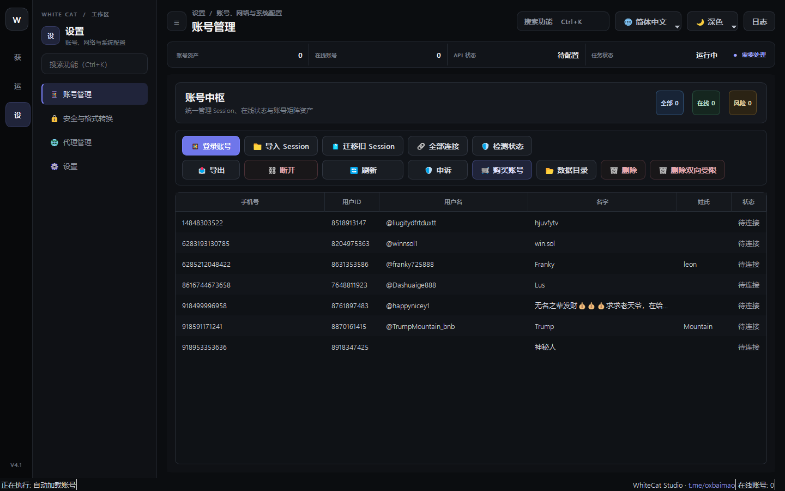

### ✨ 核心特性与功能亮点
- 支持批量导入 .session 文件、TData 文件夹及手机号验证码直接登录
- 支持一键「全部连接」与「检测状态」，实时标识正常、受限、失效账号
- 账号资产集中统计：总资产数、在线数、风险受限数一目了然
- 支持「剔除双向受限」与「一键申诉」，快速清洗受损号池

### 🛠️ 标准实战操作流程
1. 点击上方「导入 Session」或「登录账号」，选择本地存储的 Telegram 登录凭据；
2. 在账号列表中勾选需要启用的账号，点击「全部连接」；
3. 观察表格中「状态」列，显示绿色「在线」即表示账号已进入就绪池，可供各业务模块并发调度；
4. 定期点击「检测状态」，遇到被官方限制的账号可直接点击「申诉」调起自动化官方解封申诉。

### 🛡️ 工业级防封与实操技巧
- 新买的协议号（Session）建议先使用「代理管理」绑定固定纯净原生 IP，切忌单个 IP 同时登录数十个账号；
- 首次导入后建议静置 12~24 小时进行常规心跳读取，再进入「批量加群」或「成员采集」业务，防风控触发。

---

## 02. 底座 · 代理管理

> 📌 **核心定位**：工业级代理池中枢，支持 Socks5 / HTTP / MTProto 代理的批量导入、延迟测速与账号动态绑定。

### 💡 解决的核心商业痛点
同 IP 多账号引发风控连坐封禁，劣质代理高延迟导致发信超时、丢包和任务中断。

### 📸 核心界面高清图解

  

### ✨ 核心特性与功能亮点
- 支持单条添加或从文本/URL 批量导入数千条 Socks5/HTTP 代理
- 内置多线程高并发测速引擎，实时检测真实连通性与往返延迟（RTT）
- 智能路由绑定：支持 1 账号 1 独立代理固定绑定，避免跨国漂移
- 支持自动剔除超时/不可用代理，确保业务执行百分之百畅通

### 🛠️ 标准实战操作流程
1. 进入「代理管理」页面，点击「批量导入」，粘贴 `ip:port:user:pass` 格式的代理列表；
2. 点击「批量测试」，系统将在几秒内完成并发测速，并在列表高亮显示有效低延迟节点；
3. 点击「一键分配」，系统将自动将健康代理与「账号管理」中的未绑定账号进行 1:1 独立绑定；
4. 勾选「故障自动重试」，当某节点网络波动时系统自动无缝切换备用健康代理。

### 🛡️ 工业级防封与实操技巧
- 推荐使用住宅代理（Residential Proxy）或机房原生静态原生 IP；
- 营销任务中账号绑定的代理所属国家/地区最好与账号注册手机号的国家区号保持一致，风控权重最高。

---

## 03. 底座 · 安全与格式转换

> 📌 **核心定位**：跨平台 Telegram 账号凭据桥梁，实现 TData、Telethon Session、Pyrogram Session、JSON 格式无损双向转换。

### 💡 解决的核心商业痛点
市场上买到的账号格式各异（有的只有电脑桌面端 TData 文件夹，有的只有 Session），格式不通导致工具无法使用。

### 📸 核心界面高清图解

  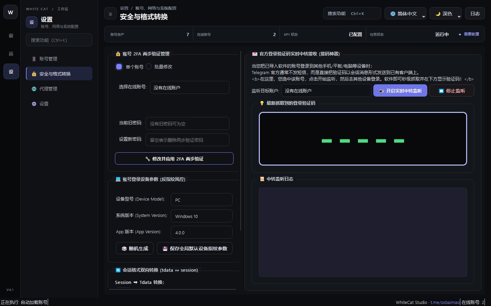

### ✨ 核心特性与功能亮点
- 桌面端 TData 转 Telethon .session（秒级提取无需重新接收短信码）
- Telethon Session 与 Pyrogram Session 互转，支持跨开源项目无缝迁移
- 批量提取账号详情元数据并导出为标准 JSON/CSV 清单
- 内置 2FA 两步验证密码批量核验与重设功能

### 🛠️ 标准实战操作流程
1. 在转换类型中选择「TData 转 Session」或「Session 互转」；
2. 选择包含 TData 文件夹的父级目录或 Session 文件列表；
3. 如果账号带 2FA 两步验证密码，在密码栏填入默认密码或指定映射文件；
4. 点击「开始批量转换」，转换成功的 Session 将自动保存至 output 目录并支持一键直接导入至账号管理池。

### 🛡️ 工业级防封与实操技巧
- 从 TData 转换 Session 时，务必确保对应的 Telegram 官方桌面端已完全退出，避免本地 SQLite 锁死；
- 转换完成后建议使用「安全检测」跑一次状态诊断，验证 AuthKey 的持久有效性。

---

## 04. 底座 · 系统配置与 MCP 智能体

> 📌 **核心定位**：系统核心参数配置，以及全行业首创的 41 项 MCP (Model Context Protocol) 智能体调度控制台。

### 💡 解决的核心商业痛点
配置繁琐、无法与现代前沿大模型协同，传统脚本只能机械运行无法根据实时反馈自适应调整策略。

### 📸 核心界面高清图解

  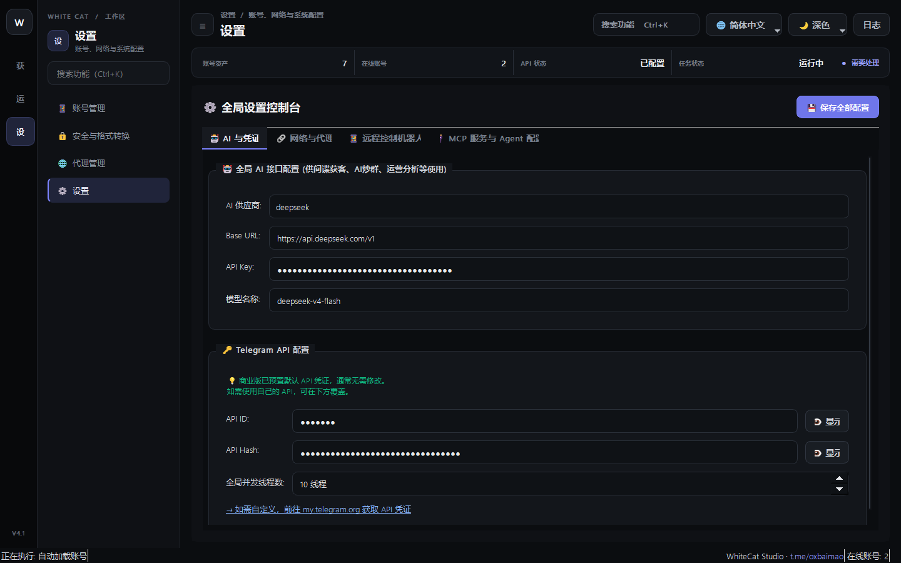

### ✨ 核心特性与功能亮点
- API 凭据配置：自定义配置官方 Telegram API ID 与 API Hash
- 内置前置全局网络探测隧道，无需开启全局 VPN TUN 模式即可直连
- 一键配置本机所有主流 AI Agent（Claude Desktop、Cursor、Codex、Antigravity、Windsurf）
- 41 项 MCP 协议工具实时就绪，支持 AI 自然语言全自动接管获客系统

### 🛠️ 标准实战操作流程
1. 填入您申请的 Telegram API ID 与 Hash（亦可使用内置商业默认高速通道）；
2. 点击「自动探测本地代理」，软件将自动识别本机运行的 Clash/v2rayN 并一键建立前置隧道；
3. 在「MCP 智能体配置」板块，点击「⚡ 一键配置本机所有 AI Agent」；
4. 重启您的 Claude Desktop 或 Cursor，即可在对话框中直接通过一句话让 AI 调度软件所有获客功能！

### 🛡️ 工业级防封与实操技巧
- MCP 协议支持只读审计与完全读写两种权限，生产环境中可按需开启 `--allow-writes` 授权；
- 若遇到系统提示代理连接失败，直接在网络设置中将前置隧道代理端口对应本机代理端口即可。

---

## 05. 海外精准获客 · 成员采集

> 📌 **核心定位**：毫秒级超并发成员抓取引擎，支持从万人超级群组中深度采集真实活跃潜客，自动剔除僵尸号与广告号。

### 💡 解决的核心商业痛点
手动拉群慢如蜗牛，采集到的名单充斥着数年前不在线的死号，导致后续群发和私信大量浪费配额。

### 📸 核心界面高清图解

  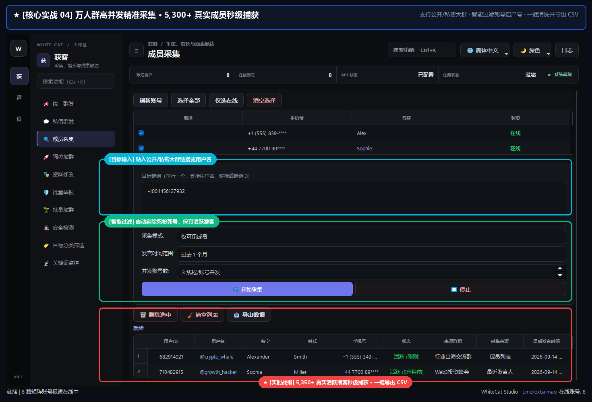

### ✨ 核心特性与功能亮点
- 支持公开群链接（@username）、私密邀请链接（t.me/+xxx）及群组 ID 采集
- 多线程账号轮询并发抓取，突破 Telegram 单账号 10,000 采集硬上限
- 多维度过滤：按「最近活跃时间（1天/3天/1个月）」、「有无用户名」、「注册时间」精确清洗
- 一键导出标准 CSV 格式名单，含 UserID、Username、昵称、手机号、最后发言时间

### 🛠️ 标准实战操作流程
1. 在「执行账号选择」中勾选 1~3 个就绪在线账号作为采集器；
2. 在「目标群组」文本框输入目标超级群链接或用户名；
3. 选择采集模式（推荐「仅可见活跃成员」），设置发言时间范围（如「过去 1 个月」）；
4. 点击「开始采集」，下方列表将实时跳动显示抓取到的潜客详情；
5. 采集完成后点击「导出数据」，直接保存为 CSV 表格用于后续私信或强拉加群。

### 🛡️ 工业级防封与实操技巧
- 选择「发言时间范围」为最近 1 周到 1 个月，能将后续群发私信的回复率直接提升 3~5 倍；
- 针对隐藏了成员列表的群组，系统支持智能切换至「最近发言人截流模式」持续抓取真实说话买家。

---

## 06. 海外精准获客 · 关键词监控

> 📌 **核心定位**：0 秒级全局商机监听引擎，毫秒级捕获海量公域群组中的购货、求购意向，联动本地风控黑名单实时筛查。

### 💡 解决的核心商业痛点
无法 24 小时盯盘几百个大群，客户刚发出求购消息就被同行迅速截流抢单，或者联系到黑产骗子遭受损失。

### 📸 核心界面高清图解

  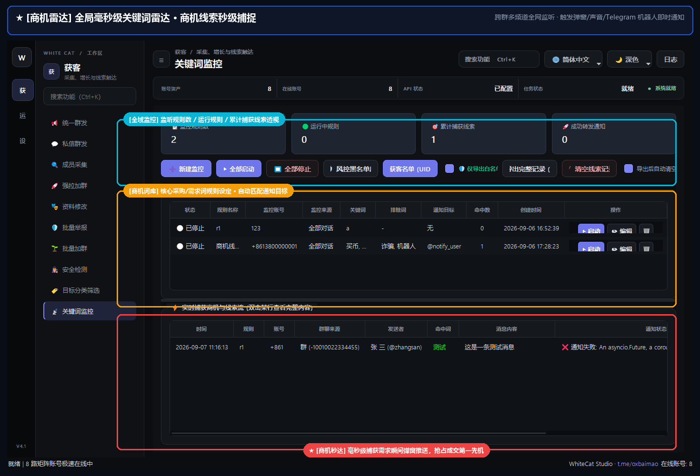

### ✨ 核心特性与功能亮点
- 0 延迟实时事件拦截：利用 MTProto 协议事件推送，消息发出 10 毫秒内瞬间捕获
- 支持多词逻辑组合：支持包含词、必需词、排除词（如排除「诈骗、广告」）
- 独家本地风控信誉核验：自动核验发言人账号年龄、黑名单库，拦截高危诈骗号
- 自动化转发通知：命中商机可自动实时转发至指定的 Telegram 业务员私聊或通知群

### 🛠️ 标准实战操作流程
1. 点击「新建监控」，输入规则名称并选择负责监控的在线账号；
2. 填入监控关键词（如 `买U, 求购, 供求, 批发, 价格`）及排除词；
3. 设置通知目标（可填写自己的业务员 Telegram 用户名，如 `@my_sales_bot`）；
4. 点击「全部启动」，系统开始后台静默监听；
5. 一旦有人在监控群中触发关键词，下方「实时捕获商机流」将高亮显示，并自动推送到您的手机！

### 🛡️ 工业级防封与实操技巧
- 合理配置「排除词」（如：机器人、发布、频道）可将误报率降低 90% 以上；
- 结合「风控黑名单」功能，可随时在列表对恶意用户一键拉黑，该用户后续所有发言将自动无感静默过滤。

---

## 07. 海外精准获客 · 统一群发

> 📌 **核心定位**：企业级多账号轮询群发引擎，支持向海量目标公开群/超级群批量投放商业推广与富媒体营销卡片。

### 💡 解决的核心商业痛点
单号狂发被秒封、发信频次固定被风控特征捕捉、内容单一被 Telegram 全局哈希去重过滤。

### 📸 核心界面高清图解

  

### ✨ 核心特性与功能亮点
- 支持多账号自动轮流出击，单个账号发满指定上限自动冷却轮换下一账号
- 支持 Markdown / HTML 富文本排版，支持附带图片、视频、按钮等富媒体卡片
- 内置文本旋转（SpinTax）语法支持（如 `{您好|Hi|Hello}`），确保每条消息哈希值完全不同
- 智能化发送保护：随机发送间隔抖动、自动模拟真人打字中（Typing...）动作

### 🛠️ 标准实战操作流程
1. 勾选参与群发任务的多批次在线账号；
2. 在「消息编辑」框撰写推广文案，使用 SpinTax 随机语法丰富话术变体；
3. 在「目标列表」粘贴目标 Telegram 群组链接或用户名（支持批量导入 TXT）；
4. 设置风控参数：推荐「每个账号发 5~10 条后切换」、「发信间隔 15~35 秒随机」；
5. 点击「开始群发」，在右侧实时日志查看发送进度与送达状态。

### 🛡️ 工业级防封与实操技巧
- 切勿使用新注册当天的小号进行高频群发，建议使用经过「批量加群/暖号」养护 3 天以上的老号；
- 遇到群内开启了慢速模式（Slow Mode），系统会自动检测并跳过或智能等待冷却时间。

---

## 08. 海外精准获客 · 私信群发

> 📌 **核心定位**：精准点对点私域触达系统，根据成员采集或关键词沉淀的优质潜客白名单，执行拟真人 1v1 私聊直达。

### 💡 解决的核心商业痛点
私聊陌生人最易被触发 SpamReport 限制，普通机器人直接丢广告直接被拉黑死号。

### 📸 核心界面高清图解

  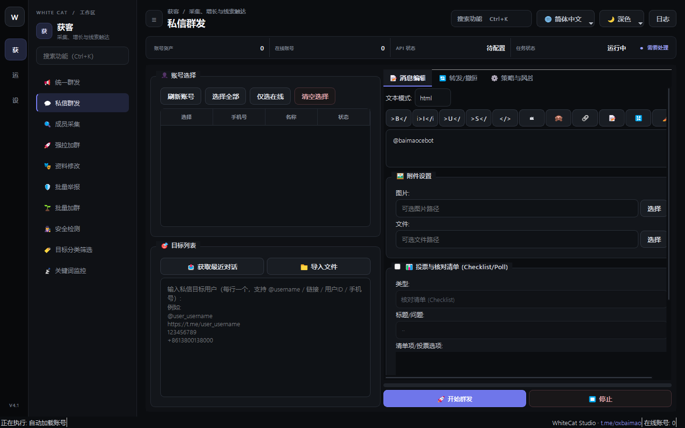

### ✨ 核心特性与功能亮点
- 支持从「成员采集」导出的 CSV 直接一键导入潜客 UserID 或 Username
- 支持变量替换功能（自动在话术中插入客户的真实昵称，增强信任度）
- 智能避开互不相关陌生人限制，优先触达共同所在群组的社群成员
- 自动检测对方是否设置了私聊隐私限制，遇到受阻自动安全跳过并记录

### 🛠️ 标准实战操作流程
1. 导入待触达的目标潜客列表（支持直接加载采集结果）；
2. 编写亲和力强的破冰文案（如：`Hi {name}，在某某群看到您在寻找相关的服务...`）；
3. 配置发送策略：每个账号建议每日控制在 20~40 条精准私信以内；
4. 点击「启动私信」，系统将调度账号池依次发起对话。

### 🛡️ 工业级防封与实操技巧
- 配合「资料修改」功能，先将发信账号包装成与目标行业高度相符的专家/客服人设，转化率显著飙升；
- 话术结尾尽量以轻量提问结尾（如“方便给您发送一份报价表吗？”），引导对方回复一次即可彻底解除风控限制。

---

## 09. 海外精准获客 · 强拉加群

> 📌 **核心定位**：利用 Telegram MTProto 协议底层接口，将采集到的高意向目标潜客批量强制拉入自建的私域群组或频道。

### 💡 解决的核心商业痛点
自建群冷启动极其困难，发广告别人不肯主动点击加群链接，社群毫无活跃人气。

### 📸 核心界面高清图解

  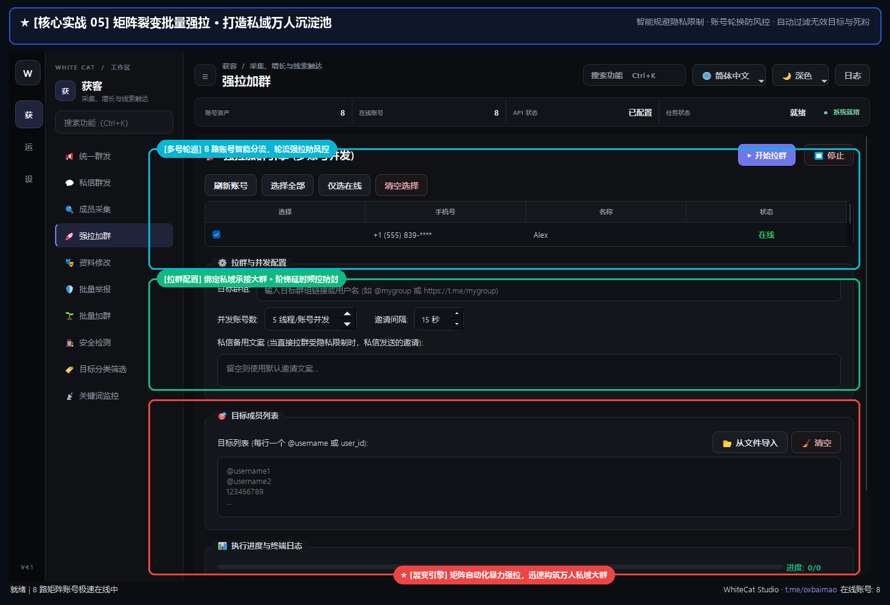

### ✨ 核心特性与功能亮点
- 支持将名单批量拉入超级群（Supergroup）与普通群组
- 多管理员账号并发拉人，自动均衡分配拉人配额，防触发 PeerFlood 限制
- 支持检测目标用户的隐私加群权限（自动跳过不允许任何人加群的严格隐私账号）
- 拉入成功后自动记录历史，避免同一个人被重复拉入

### 🛠️ 标准实战操作流程
1. 确保负责执行强拉的账号已加入自建目标群，并拥有管理员或普通群员拉人权限；
2. 输入自建目标群组链接，并导入待拉入的潜客 UserID/Username 列表；
3. 设置每号单批次拉人数量（建议每号单次拉 5~15 人，间隔 60 秒以上）；
4. 点击「开始强拉」，系统将自动执行邀请，目标用户无需点击同意即直接出现在您的社群成员列表！

### 🛡️ 工业级防封与实操技巧
- 自建群组在强拉前最好先利用「AI 炒群」铺垫好 50~100 条真实讨论记录，避免新用户进群后看到空群立刻退群；
- 新创建的群组前 3 天建议循序渐进，第一天拉 100~200 人，后续逐步放大拉人规模。

---

## 10. 海外精准获客 · 批量加群与养号

> 📌 **核心定位**：新号池矩阵自动化预热与批量进群系统，模拟真人浏览、点击链接进群与自动求解进群人机验证。

### 💡 解决的核心商业痛点
刚买的新账号一发消息就死号，手动去几十个群点击加群效率极其低下，遇到复杂验证码无法通过。

### 📸 核心界面高清图解

  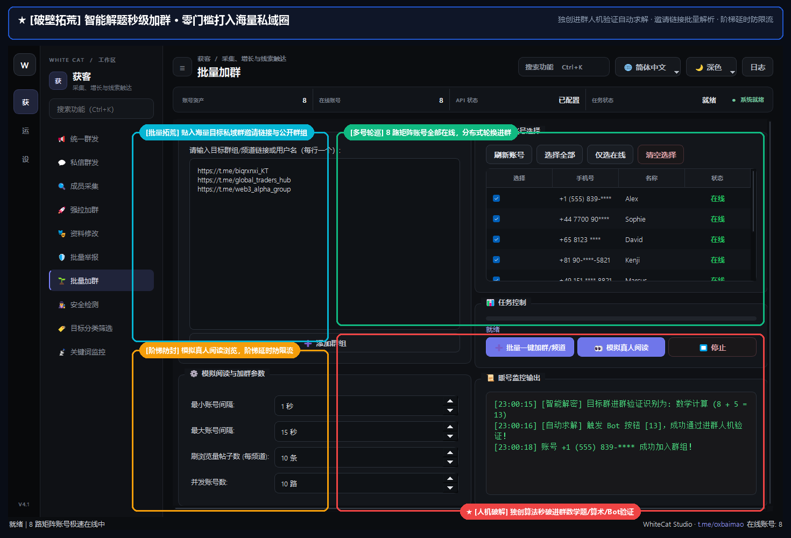

### ✨ 核心特性与功能亮点
- 支持公开群组链接与私密加群链接（t.me/+xxx）批量导入与矩阵加群
- 内置智能进群人机验证求解：自动点击 Inline 按钮（如「点此通过验证」）、数学加减法求解
- 拟真人暖号行为模拟：加群后自动停留浏览历史消息、随机点赞表情（Reactions）
- 进群频率智能控速，彻底杜绝短时间内疯狂加群触发官方封号

### 🛠️ 标准实战操作流程
1. 选择需要养护的新账号列表；
2. 在目标列表粘贴准备好的热门社群链接（可从垂直行业大群采集）；
3. 设置每个账号计划加入的群数（如每天 3~5 个群）及间隔时间；
4. 开启「自动求解进群验证」开关，点击「批量一键加群/频道」；
5. 系统将自动处理入群请求，并完成验证机器人给出的挑战。

### 🛡️ 工业级防封与实操技巧
- 养号黄金法则是「慢即是快」，新号第一周保持加群和自然阅读，第二周再开启轻量私聊，账号寿命可长达数月乃至数年；
- 遇到需要 Bot 发私聊验证的极个别群组，系统支持通过 MCP 智能体无缝将截图交由大模型实时求解。

---

## 11. 海外精准获客 · 资料修改

> 📌 **核心定位**：矩阵账号人设批量包装与一键覆写工具，支持批量更换头像、昵称、个性签名（Bio）及用户名（@username）。

### 💡 解决的核心商业痛点
手动逐个登录账号修改资料耗时耗力，资料雷同度过高容易被系统识别为矩阵机器人并连坐限制。

### 📸 核心界面高清图解

  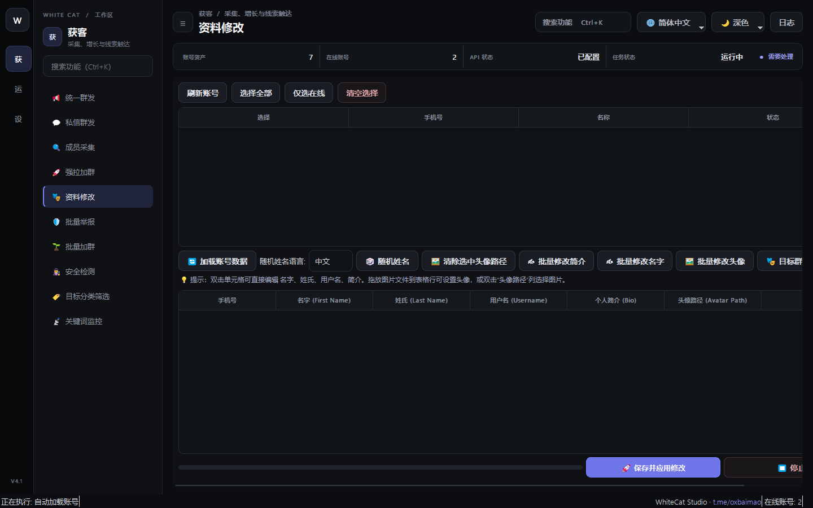

### ✨ 核心特性与功能亮点
- 支持从本地图片文件夹中为各账号随机或顺序分配专属头像
- 支持昵称随机前缀/后缀，个性签名支持多变量随机话术注入
- 支持一键检测并修改用户名（@username），自动检测重名
- 与 MCP 智能体联动：支持给出一个目标标杆账号，AI 自动毫秒级 1:1 克隆其全套人设资料！

### 🛠️ 标准实战操作流程
1. 勾选需要统一换装包装的账号列表；
2. 在「基本资料」输入名字规则（如 `客服_{rand4}`）、个性签名（如 `专注海外营销业务，咨询请私聊`）；
3. 点击「选择头像目录」，指定本地存放职业商务头像的图片文件夹；
4. 点击「应用到选中账号」，系统将在后台无声完成所有账号的资料更新。

### 🛡️ 工业级防封与实操技巧
- 个性签名中切勿直接塞入露骨的联系方式外链，可写“私信获取官方通道”等软性引导词，规避敏感词审查；
- 克隆目标人设时，配合「统一群发」使用，可达到真假难辨的极高信任获客转化效果。

---

## 12. 海外精准获客 · 安全检测

> 📌 **核心定位**：账号池全自动健康度体检诊断系统，深度查询 Telegram 官方限制、SpamBot 受限详情及精确解封时间。

### 💡 解决的核心商业痛点
账号被限制了自己完全不知情，依然在跑群发和加群任务，结果全都是无用功并导致封禁恶化。

### 📸 核心界面高清图解

  

### ✨ 核心特性与功能亮点
- 一键批量对号池执行全局健康度扫描，检测 Session 是否依然有效活着
- 自动向官方 @SpamBot 发起交互会话，提取官方原始回复文本
- 智能结构化提取受限性质（如「双向受限」、「群发禁言」）及 UTC 精确解封时间点
- 提供一键「清理失效/被限制账号」并安全隔离归档

### 🛠️ 标准实战操作流程
1. 选择需要体检的账号列表；
2. 点击「启动安全检测」；
3. 等待检测完成，表格中将呈现每个账号的「健康状态」、「SpamBot 详细报告」及「预计解封时间」；
4. 点击「一键隔离异常账号」，系统会自动将不可用的死号从活跃工作池中剥离至归档文件夹。

### 🛡️ 工业级防封与实操技巧
- 大部分轻度双向限制通常会在 24~72 小时内自动解除，切勿在受限期间强行使用该账号进行任何操作；
- 每天开始大型群发任务之前，先跑一次「安全检测」，能确保后续任务成功率稳定在 95% 以上。

---

## 13. 海外精准获客 · 目标分类筛选

> 📌 **核心定位**：客户画像多维度清洗与潜客分层漏斗，将粗颗粒度的海量采集数据提炼为高意向、高净值的优质客户池。

### 💡 解决的核心商业痛点
采集了 10 万个名单，里面既有同行管理人员、又有外语散户，盲目群发不仅成本高且容易招致大量投诉。

### 📸 核心界面高清图解

  

### ✨ 核心特性与功能亮点
- 按身份角色识别：自动标识群主、管理员、活跃普通群员、 Bot 机器人
- 语言与地域分流：根据群员昵称与个性签名自动判定母语（中文/英语/俄语/西语等）
- 按活跃度与历史行为权重赋分，智能打上「高意向大客户」、「普通潜在用户」等标签
- 支持将清洗后的分层数据直接一键投递给「私信群发」或「强拉加群」模块

### 🛠️ 标准实战操作流程
1. 在页面中导入先前采集的原始名单 CSV 文件；
2. 在筛选面板勾选过滤条件（如：排除管理员、只保留使用特定语言、最近 3 天有发言记录）；
3. 点击「开始分类筛选」，系统将在毫秒之间完成数十万行数据的深度清洗；
4. 查看清洗结果汇总，点击「保存清洗后名单」或直接「一键推送到私信任务」。

### 🛡️ 工业级防封与实操技巧
- 排除掉群主和管理员之后再去私聊，被举报（Spam Report）的概率会骤降 80% 以上！
- 根据语言分流后，配合对应语种的营销话术开展精准营销，转化率提升尤为明显。

---

## 14. 海外精准获客 · 批量举报

> 📌 **核心定位**：竞品与黑产违规群组矩阵反制工具，调度多账号协同向 Telegram 官方滥用监管中心发起合规举报。

### 💡 解决的核心商业痛点
辛辛苦苦建起的社群经常被黑产机器人恶意炸群、恶意拉人或恶意冒充，投诉无门。

### 📸 核心界面高清图解

  

### ✨ 核心特性与功能亮点
- 支持对违规 Telegram 用户、群组、频道、指定违规消息链接进行批量举报
- 内置官方全部违规举报类别：垃圾广告（Spam）、冒充诈骗（Fake/Scam）、侵权（Copyright）、暴力（Violence）等
- 多账号轮询发起投诉，自动附带不同维度的举报证据与申诉理由描述
- 实时记录各账号的举报执行结果与官方受理状态

### 🛠️ 标准实战操作流程
1. 在目标栏输入违规用户、群组链接或具体违规消息地址；
2. 选择举报理由类型（如「诈骗伪造」或「商业垃圾广告」）；
3. 可填入详细的英文违规事实说明（如 `This channel is impersonating our official brand...`）；
4. 勾选用于执行反制举报的账号，点击「开始批量举报」。

### 🛡️ 工业级防封与实操技巧
- 举报理由必须客观真实，切勿无故滥用举报功能；附带精准的违规消息链接权重最高；
- 建议使用注册时间较长、权重较高的老账号进行举报，更容易引起官方合规审核团队的迅速受理与封停。

---

## 15. 社群活跃 · AI 炒群

> 📌 **核心定位**：革命性多角色双簧互动与智能水军炒群引擎，模拟多个真人账号在社群中围绕指定话题展开自然热聊与讨论。

### 💡 解决的核心商业痛点
新群冷清无人说话、进来的客户感觉群是死的马上退群；人工雇水军成本高昂、作息无法保障且话术生硬刻板。

### 📸 核心界面高清图解

  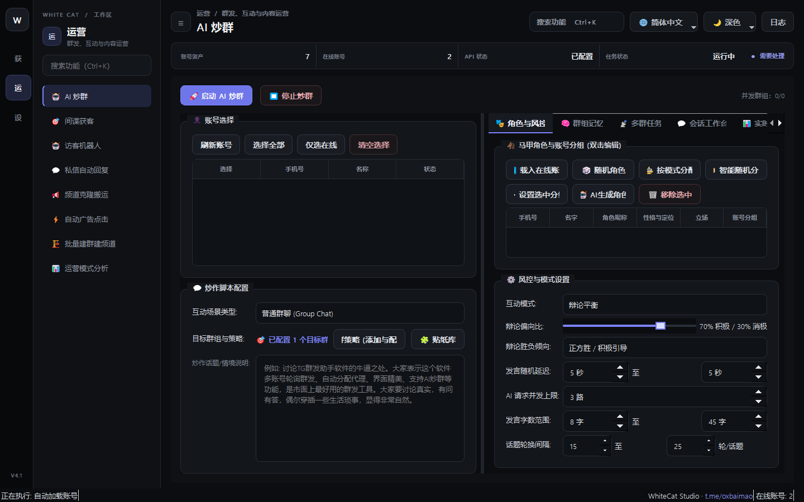

### ✨ 核心特性与功能亮点
- 支持对接主流大模型（OpenAI GPT-4o、DeepSeek、Claude、Ollama 本地私有化模型）
- 自动为不同账号分配鲜明的角色人设（如：行业小白求教者、挑剔质疑者、老手推荐官、官方答疑客服）
- 支持辩论平衡控制：正方偏向比、负方偏向比、最终导向正向胜出/积极引导
- 拟真人行为细节：模拟真人打字延迟（5~45秒）、随机插入贴纸表情（Stickers）、自动多轮自然转折

### 🛠️ 标准实战操作流程
1. 在「账号选择」勾选 2~5 个在线账号参与炒群矩阵；
2. 在「炒作脚本配置」中选择目标社群，并在「炒作话题说明」填入本场核心目的（例如：`讨论某某软件的使用体验，有人提出质疑，老用户出来解答并夸赞其效率高，最终引导大家联系客服`）；
3. 配置风控参数：设置发言随机延迟（如 10~30 秒）、单条发言字数范围；
4. 点击「启动 AI 炒群」，账号们将自动开始像真人一样互相接话、探讨、烘托出火爆的社群讨论氛围！

### 🛡️ 工业级防封与实操技巧
- 在情境说明里写得越具体（例如说明核心卖点、价格优势），AI 角色对话就越自然逼真，毫无机器人违和感；
- 建议在社群中混入 1 个官方客服号，当群内水军聊到关键痛点时，客服号顺理成章出来收单，成单率惊人！

---

## 16. 社群活跃 · 间谍获客

> 📌 **核心定位**：竞品社群静默监听与隐蔽商机情报截流系统，在不惊动竞品管理员的前提下自动抓取高价值潜客动向。

### 💡 解决的核心商业痛点
同行群里每天都有大量精准客户在咨询下单，自己人工去盯容易被踢被封，且无法第一时间介入抢单。

### 📸 核心界面高清图解

  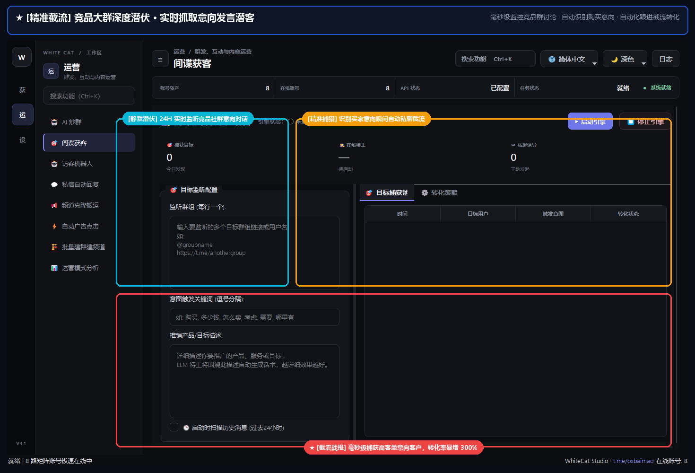

### ✨ 核心特性与功能亮点
- 账号以完全隐蔽的静默方式潜伏在竞品社群中，不发任何消息、不产生任何特征
- 实时捕获竞品群内所有成员提问、询价、吐槽，智能分析客户意向评级
- 支持消息实时镜像：可将竞品群的精华内容/提问自动转发至内部监控群
- 联动「私信群发」：发现高意向潜客后，后台自动指派另一批全新马甲小号去私信触达，彻底防封防踢

### 🛠️ 标准实战操作流程
1. 在间谍引擎中添加待潜伏监控的竞品公开群或私密大群；
2. 设置意向抓取规则（如匹配含有价格、怎么买、有没有现货等提问短句）；
3. 配置截流响应策略：设定「截流延迟时间」（如在客户发言 30 秒后由外部马甲小号发起私聊，伪装成热心群友）；
4. 点击「启动间谍获客」，系统开始全天候隐蔽情报采集与自动截流。

### 🛡️ 工业级防封与实操技巧
- 潜伏账号与最终执行私信触达的账号必须严格隔离，这样即使私信小号被对方拉黑，潜伏的间谍大号依然稳如泰山；
- 触达话术切忌生硬直接说自己是卖东西的，可采用“看到你在群里问那个，我之前用过他们家/另外一家，感觉更便宜稳定”等亲和姿态。

---

## 17. 社群活跃 · 访客机器人

> 📌 **核心定位**：自建社群与频道的拟真访客巡游自动化系统，模拟自然用户的进群、浏览、在线、潜水与自然交互。

### 💡 解决的核心商业痛点
自建群成员数量看着多，但「当前在线人数」只有个位数，真实客户进群后觉得是死群，毫无信任感。

### 📸 核心界面高清图解

  

### ✨ 核心特性与功能亮点
- 批量调度矩阵账号在不同时段轮流保持「在线（Online）」状态
- 自动模拟在群内滑动浏览历史消息，触发 Telegram 底层的消息阅读量（Views）增加
- 支持进出群动态拟真：按自然规律每天少量进群、偶尔退群，完全符合真实社群成长曲线
- 支持对频道或群组重要消息批量自动添加正向表态（Emojis 表情点赞）

### 🛠️ 标准实战操作流程
1. 选择用于维护社群热度的访客账号批次；
2. 输入自建目标群组或频道链接；
3. 设置日间/夜间在线比例分布，设定阅读消息的滑动深度；
4. 点击「启动访客巡游」，系统将在云端平滑维持社群的高在线人数指标。

### 🛡️ 工业级防封与实操技巧
- 在重要营销公告发布后，使用访客机器人为该消息一键刷上 50~100 个点赞（👍/🔥/❤️），从众心理会促使真实客户更快信任并转化；
- 在线时段建议参考目标市场目标用户的时区（如东南亚、欧美或中东时间）进行针对性配置。

---

## 18. 社群活跃 · 私信自动回复

> 📌 **核心定位**：7×24 小时全天候智能客服与线索承接中枢，支持精准规则触发与 AI 大模型智能多轮问答接客。

### 💡 解决的核心商业痛点
时差原因晚上无法及时回复客户导致成单流失，多账号群发后同时涌入上百个客户咨询，人工回复手忙脚乱。

### 📸 核心界面高清图解

  

### ✨ 核心特性与功能亮点
- 规则匹配引擎：支持关键词精确匹配、模糊包含匹配，支持设置回复延迟防秒回风控
- AI 智能意图识别：挂载大模型，根据设定的公司业务知识库，自动扮演专业销售顾问进行问答
- 支持图文、价格表附件自动发送，支持将聊到成熟阶段的意向客户自动转交人工 Telegram
- 多账号集中式应答：所有工作账号收到的私聊消息，由同一系统集中智能应答处理

### 🛠️ 标准实战操作流程
1. 在「自动回复配置」中添加常见问答规则（例如：关键词 `价格|多少钱` ➔ 回复产品报价单）；
2. 开启「AI 智能客服模式」，在提示词栏填入公司业务背景与承接话术；
3. 设置回复延迟参数（推荐 3~10 秒，模拟真人打字反应时间）；
4. 点击「启动自动回复」，系统即刻接管所有在线账号的来信咨询。

### 🛡️ 工业级防封与实操技巧
- 千万不要设置「0秒立即秒回」，Telegram 底层对瞬间毫秒级回复陌生人私信非常敏感，设置 5 秒左右的拟真打字延迟最安全；
- 可在 AI 设定中加入限制：“遇到具体支付付款时，请引导客户联系唯一指定官方财务账号”，确保资金链路安全。

---

## 19. 社群活跃 · 频道克隆搬运

> 📌 **核心定位**：高权重竞品频道内容一键全自动克隆、搬运与实时同步工具，快速构建专业度极高的私域内容矩阵。

### 💡 解决的核心商业痛点
自建频道每天写文案、找配图耗费数小时；新频道空空如也，缺少长期运营积淀的内容支撑。

### 📸 核心界面高清图解

  

### ✨ 核心特性与功能亮点
- 支持将公开或私密频道的历史所有文字、图片、视频、文件一键完整克隆至自建新频道
- 智能文本清洗替换：自动扫描原文中的竞品广告链接、联系方式，并一键替换为您自己的营销信息！
- 支持「实时监听同步」：竞品频道一旦更新发布新消息，自建频道在秒级内自动清洗并无缝同步发布
- 支持调整消息发布时间戳间隔，模拟长期循序渐进的日常发帖节奏

### 🛠️ 标准实战操作流程
1. 输入来源竞品频道链接，输入您拥有管理员权限的自建目标频道链接；
2. 在「内容替换规则」中配置替换字典（例如：将原文的 `@old_contact` 替换为 `@my_official`）；
3. 选择搬运范围（支持「全部历史消息」或「从最新第 N 条开始克隆」）；
4. 点击「开始克隆搬运」，系统将自动完成媒体下载、文本过滤、广告清洗并以您的频道身份重新发布！

### 🛡️ 工业级防封与实操技巧
- 建议开启「自动抹除原文水印/转发来源标签」，克隆出来的消息将显示为您频道的原生原创发布；
- 同步大体积视频时，确保本地网络带宽充裕，系统会自动进行分片续传以保障完整性。

---

## 20. 社群活跃 · 自动广告点击

> 📌 **核心定位**：Telegram 赞助广告（Telegram Ads）自动化巡回点击与互动工具，提高账号行为权重与官方引流效果。

### 💡 解决的核心商业痛点
海外 Telegram 广告任务或自动化浏览需求繁琐，人工点击耗时低效。

### 📸 核心界面高清图解

  

### ✨ 核心特性与功能亮点
- 自动识别目标公开大群或频道中出现的官方赞助广告按钮与卡片
- 多账号矩阵模拟真实用户进行周期性点击、跳转浏览与停留阅读
- 内置点击间隔防检测算法，完全规避机器人异常行为指纹
- 统计累计广告曝光量、有效点击量与跳转留存率数据报表

### 🛠️ 标准实战操作流程
1. 选择执行广告浏览任务的账号列表；
2. 指定需要巡查的目标频道或群组列表；
3. 设置随机浏览时长与点击概率阈值；
4. 点击「启动广告自动化任务」，系统将在后台安全静默运转。

### 🛡️ 工业级防封与实操技巧
- 该模块不仅可用于广告互动，更是账号养护中极其重要的「日常自然行为模拟」利器；
- 配合代理池使用，可模拟来自全球不同地理位置的真实用户受众群体。

---

## 21. 社群活跃 · 批量建群建频道

> 📌 **核心定位**：多账号矩阵公域霸屏与私域流量池批量搭建引擎，支持一键批量创建群组、公开超级群与广播频道。

### 💡 解决的核心商业痛点
手动创建 50 个群组需要切换几十次账号、一个个打字上传头像，手指按到抽筋，速度奇慢。

### 📸 核心界面高清图解

  

### ✨ 核心特性与功能亮点
- 支持指定账号矩阵批量并发创建公开群、私密群、广播频道
- 自动设定群组标题、随机描述、自动配置群组头像
- 自动开启聊天历史记录对新成员可见，一键关闭敏感权限（如防他人乱发贴纸）
- 创建完毕后自动导出所有新生成的群组/频道链接清单（含群组 ID、邀请链接、管理员归属）

### 🛠️ 标准实战操作流程
1. 选择拥有建群权限的在线账号池；
2. 在创建模版中配置名称前缀（如 `全球出海交流群_{index}`）、描述模版及公用头像；
3. 设定每个账号计划创建的群数量（建议每号每天创建 2~5 个）；
4. 点击「开始批量创建」，稍等片刻即可一键导出整整一张完整的矩阵社群资产表格！

### 🛡️ 工业级防封与实操技巧
- 批量创建的公开超级群若能抢注到垂直行业核心大词用户名（@username），自然搜索带来的被动泛流量将源源不断；
- 创建完毕后，可无缝衔接「批量加群」让其他小号矩阵进群，再通过「AI炒群」快速把场子做热！

---

## 22. 社群活跃 · 运营模式分析

> 📌 **核心定位**：商业化全盘营销数据看板与决策驾驶舱，深度剖析社群生态健康度、获客转化漏斗与多账号产出 ROI。

### 💡 解决的核心商业痛点
每天投了很多号、发了很多信，究竟哪套话术回复率高？哪个群产出的客户多？心里完全没有数据支撑。

### 📸 核心界面高清图解

  

### ✨ 核心特性与功能亮点
- 全局可视化统计：累计发送量、触达成功率、回复咨询率、封号率多维联动统计
- 话术效果 A/B 测试对比：自动分析不同话术模版的客户反响与转化周期
- 社群生态画像：分析监控群活跃发言高峰期（时段分布图），指导最佳发信黄金时间
- 支持生成标准化商业获客分析报表，支持一键导出 CSV / PDF

### 🛠️ 标准实战操作流程
1. 进入「运营模式分析」页面；
2. 选择需要分析的时间跨度（今日、过去7天、本月或自定义周期）；
3. 查看各模块产出看板，分析哪个账号表现最稳定、哪个关键词命中率最高；
4. 根据数据反馈优化发信时间段与话术内容，实现业务获客效率的持续复利增长。

### 🛡️ 工业级防封与实操技巧
- 建议每周复盘一次转化报表，将回复率低于 2% 的劣质话术果断迭代，把精力集中在转化率最高的前 20% 核心场景；
- 结合 Telegram 海外不同时区的高峰发言期（通常为当地时间 14:00~16:00 和 20:00~22:00），集中进行发信与炒群，获客效果事半功倍！

---
