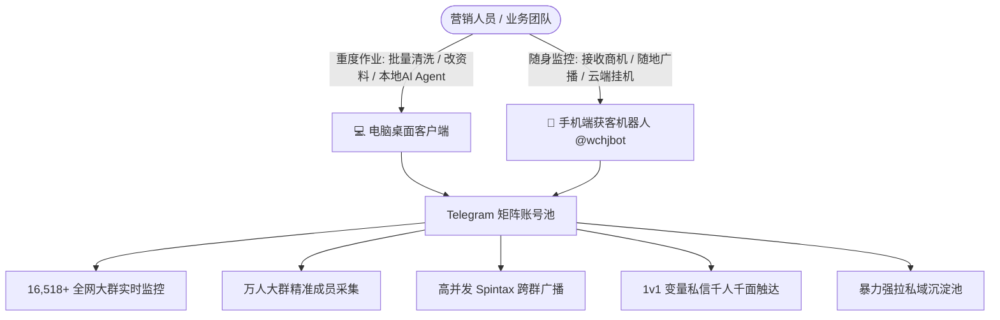

# 🏗️ 双端矩阵获客生态架构

> 💡 **核心理念**：电脑桌面客户端（专业重度营销与 AI 智能体治理） + 手机端获客机器人（7×24H 云端截流与随身广播），打造海陆空一体化获客闭环。

---

## 一、双端协同作战全景图

---

## 二、电脑端与手机端的最佳分工策略

### 💻 电脑桌面客户端（适合工作时间深耕）：
1. **大批量资产管理**：导入数十到上百个 Session/TData，批量绑定代理与硬件指纹伪装；
2. **重度内容加工**：配置复杂的 Markdown/HTML 富文本模板、图文视频附件与投票组件；
3. **深度社群治理**：批量自动化建群、频道克隆搬运、AI 剧本式炒群、SpamBot 解封诊断；
4. **41 项 MCP 智能体调度**：本地联动 OpenAI Codex、Claude Desktop、Cursor、Antigravity 等大模型，用自然语言一键操控全局。

### 📱 手机端机器人 @wchjbot（适合全天候 24H 随时随地操作）：
1. **全天候商机截流**：云端 24H 监听 1.6 万个高活跃大群，手机收到推送弹窗，1 秒内直接触达客户；
2. **移动端一键广播**：出门在外、出差途中，随时在手机 Telegram 上点击【启动群发】，自动调度云端账号池并发广播；
3. **免维护低成本**：电脑断电关机毫不影响，云端服务器集群全天候坚守任务。

---

  <a href="../SUMMARY.md">⬅️ 返回文档目录</a> | <a href="desktop_install.md">下一篇：电脑端快速安装 ➡️</a>

\n