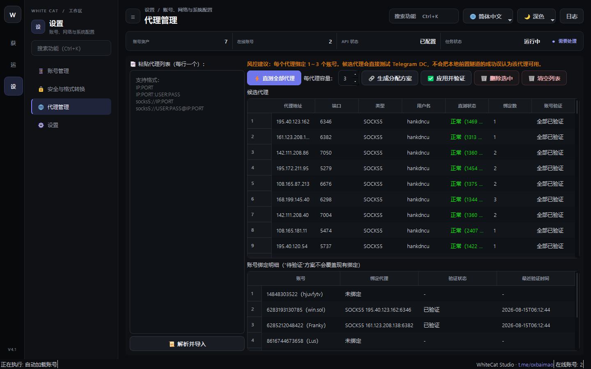

# 02. 代理管理

> 📌 **模块分类**：底座与环境设置  
> 💡 **核心定位**：工业级代理池中枢，支持 Socks5 / HTTP / MTProto 代理的批量导入、延迟测速与账号动态绑定。

---

## 一、解决的核心商业痛点
同 IP 多账号引发风控连坐封禁，劣质代理高延迟导致发信超时、丢包和任务中断。

---

## 二、界面实战图解

  

---

## 三、功能特性一览
- 支持单条添加或从文本/URL 批量导入数千条 Socks5/HTTP 代理
- 内置多线程高并发测速引擎，实时检测真实连通性与往返延迟（RTT）
- 智能路由绑定：支持 1 账号 1 独立代理固定绑定，避免跨国漂移
- 支持自动剔除超时/不可用代理，确保业务执行百分之百畅通

---

## 四、标准实战操作指南
1. 进入「代理管理」页面，点击「批量导入」，粘贴 `ip:port:user:pass` 格式的代理列表；
2. 点击「批量测试」，系统将在几秒内完成并发测速，并在列表高亮显示有效低延迟节点；
3. 点击「一键分配」，系统将自动将健康代理与「账号管理」中的未绑定账号进行 1:1 独立绑定；
4. 勾选「故障自动重试」，当某节点网络波动时系统自动无缝切换备用健康代理。

---

## 五、工业级防封与实战秘诀
- 推荐使用住宅代理（Residential Proxy）或机房原生静态原生 IP；
- 营销任务中账号绑定的代理所属国家/地区最好与账号注册手机号的国家区号保持一致，风控权重最高。

---

  <a href="../USER_MANUAL.md">⬅️ 返回总目录</a> | <a href="https://github.com/ChiSonKon/tg-sender-releases">🏠 返回项目首页</a>

