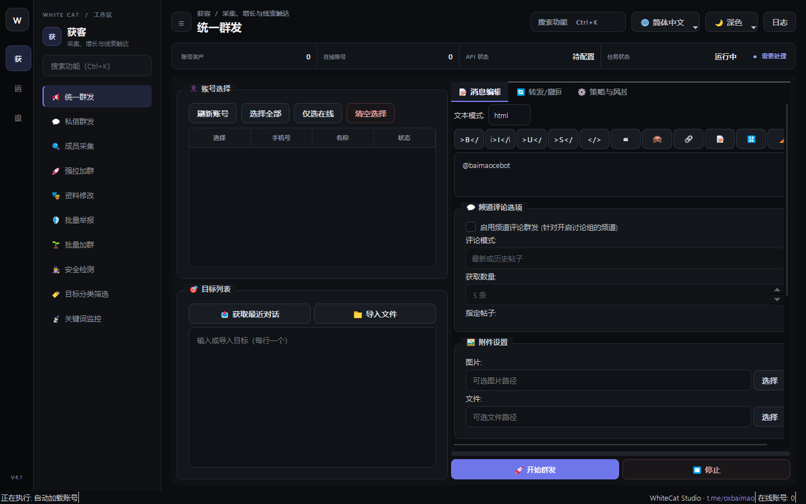

# 07. 统一群发

> 📌 **模块分类**：海外精准获客与流量裂变  
> 💡 **核心定位**：企业级多账号轮询群发引擎，支持向海量目标公开群/超级群批量投放商业推广与富媒体营销卡片。

---

## 一、解决的核心商业痛点
单号狂发被秒封、发信频次固定被风控特征捕捉、内容单一被 Telegram 全局哈希去重过滤。

---

## 二、界面实战图解

  

---

## 三、功能特性一览
- 支持多账号自动轮流出击，单个账号发满指定上限自动冷却轮换下一账号
- 支持 Markdown / HTML 富文本排版，支持附带图片、视频、按钮等富媒体卡片
- 内置文本旋转（SpinTax）语法支持（如 `{您好|Hi|Hello}`），确保每条消息哈希值完全不同
- 智能化发送保护：随机发送间隔抖动、自动模拟真人打字中（Typing...）动作

---

## 四、标准实战操作指南
1. 勾选参与群发任务的多批次在线账号；
2. 在「消息编辑」框撰写推广文案，使用 SpinTax 随机语法丰富话术变体；
3. 在「目标列表」粘贴目标 Telegram 群组链接或用户名（支持批量导入 TXT）；
4. 设置风控参数：推荐「每个账号发 5~10 条后切换」、「发信间隔 15~35 秒随机」；
5. 点击「开始群发」，在右侧实时日志查看发送进度与送达状态。

---

## 五、工业级防封与实战秘诀
- 切勿使用新注册当天的小号进行高频群发，建议使用经过「批量加群/暖号」养护 3 天以上的老号；
- 遇到群内开启了慢速模式（Slow Mode），系统会自动检测并跳过或智能等待冷却时间。

---

  <a href="../USER_MANUAL.md">⬅️ 返回总目录</a> | <a href="https://github.com/ChiSonKon/tg-sender-releases">🏠 返回项目首页</a>

