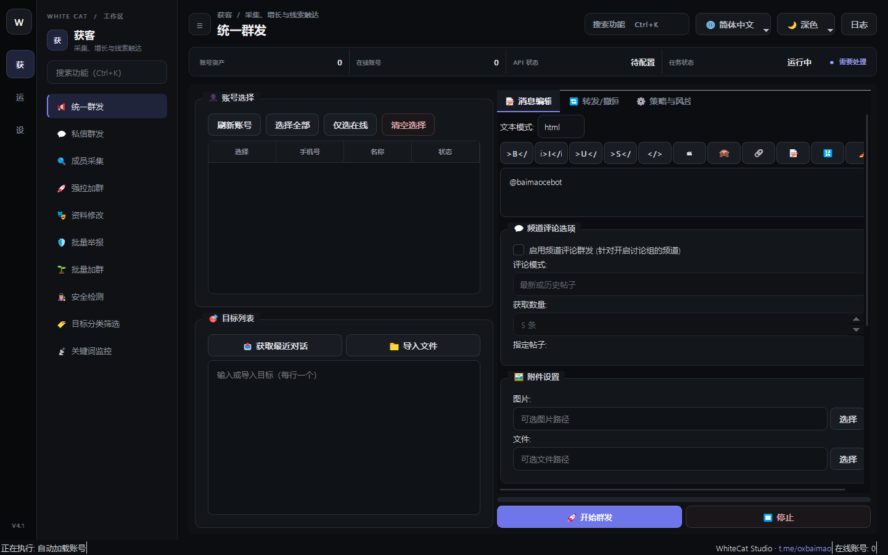

# 07. 统一群发

> 📌 **模块分类**：海外精准获客与流量裂变  
> 💡 **核心定位**：企业级多账号轮询群发引擎，支持向海量目标公开群/超级群批量投放商业推广与富媒体营销卡片。

---

## 一、解决的核心商业痛点
单号狂发被秒封、发信频次固定被风控特征捕捉、内容单一被 Telegram 全局哈希去重过滤。

---

## 二、界面实战图解

  

---

## 三、功能特性一览
- 支持多账号自动轮流出击，单个账号发满指定上限自动冷却轮换下一账号
- 支持 Markdown / HTML 富文本排版，支持附带图片、视频、按钮等富媒体卡片
- 内置文本旋转（SpinTax）语法支持（如 `{您好|Hi|Hello}`），确保每条消息哈希值完全不同
- 智能化发送保护：随机发送间隔抖动、自动模拟真人打字中（Typing...）动作

---

## 四、标准实战操作指南
1. 勾选参与群发任务的多批次在线账号；
2. 在「消息编辑」框撰写推广文案，使用 SpinTax 随机语法丰富话术变体；
3. 在「目标列表」粘贴目标 Telegram 群组链接或用户名（支持批量导入 TXT）；
4. 设置风控参数：推荐「每个账号发 5~10 条后切换」、「发信间隔 15~35 秒随机」；
5. 点击「开始群发」，在右侧实时日志查看发送进度与送达状态。

---

## 5.0.1 新增

- **两个入口**：📣 **群聊群发**（不用输入目标：点「扫描账号已加入的群」，勾选后发送；每个群只由「真的在群里」的账号发，封号 / 禁言 / 限流自动改派给同群其他账号）、📡 **频道评论**（可选评论前先让账号加入频道）。
- **开始前预检**：点「开始群发」先弹预检面板——账号状态、今日风控额度、预计耗时、可发的群数、风险提示；异常账号自动排除，确认后才开始。
- **联系人名片 / 内联机器人消息**：消息编辑页的「📇 联系人名片 / 🤖 内联机器人消息」。名片让对方看到名字、电话和「消息 / 添加」按钮；内联机器人填 `@机器人 查询词`（如 `@PostBot 40599y1muvr9a90`），发出带「via @PostBot」的图文 + 按钮帖。内联内容必须是发送账号有权使用的。
- **结果可信**：发送后回读核实消息确实存在，日志写出消息 id 与耗时；限流不再在后台悄悄等待，会按设置冷却 / 改派。
- **大量群 / 大量账号**：「🔲 放大窗口选群」可按名称、类型、账号数、人数筛选并一键勾选；「⚠ 另有 N 个群…无法发言」会列出原因——🟢 被管理员单独禁言（可以尝试退群重进再过验证）、🔴 群全员禁言（重进也没用，建议拉黑）。
- **群没有可用账号了**（账号失效 / 被禁言 / 被踢）：发送结束后可一键放入「待补群清单」，到「批量加群」载入，让健康账号补进去。
- **运行日志**：右上角「运行日志」弹出独立窗口，可放大、筛选、搜索。
- **自动修复（可选，默认关）**：「策略与风控」页的「🔧 发不出去的群怎么办」。开启后每轮发完，对没人能发的群由轻到重处理：① 被管理员禁言的账号退群重进再过验证（额度不够就不退）→ ② 让其他健康账号加入并自动过验证 → ③ 修好的群立刻补发。每轮最多修 N 个群、每个群最多修 1 次、私有群不碰；会占用账号入群额度，有被风控的风险，所以由你决定。

---

## 五、工业级防封与实战秘诀
- 切勿使用新注册当天的小号进行高频群发，建议使用经过「批量加群/暖号」养护 3 天以上的老号；
- 遇到群内开启了慢速模式（Slow Mode），系统会自动检测并跳过或智能等待冷却时间。

---

  <a href="../USER_MANUAL.md">⬅️ 返回总目录</a> | <a href="https://github.com/ChiSonKon/tg-sender-releases">🏠 返回项目首页</a>

