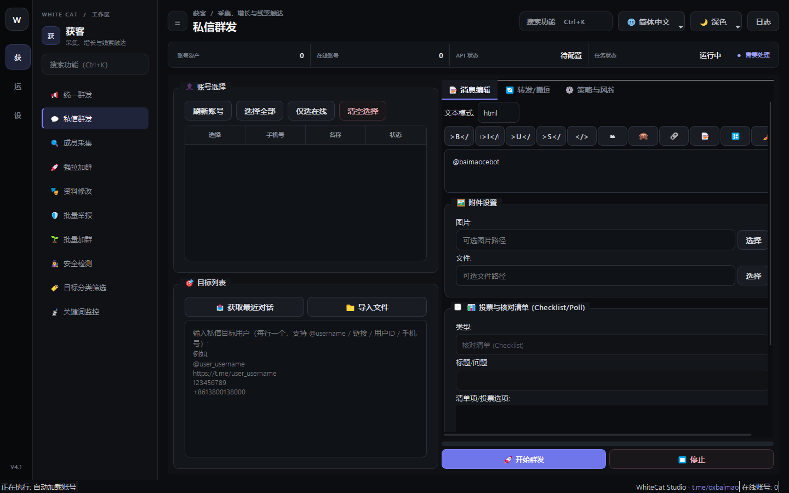

# 08. 私信群发

> 📌 **模块分类**：海外精准获客与流量裂变  
> 💡 **核心定位**：精准点对点私域触达系统，根据成员采集或关键词沉淀的优质潜客白名单，执行拟真人 1v1 私聊直达。

---

## 一、解决的核心商业痛点
私聊陌生人最易被触发 SpamReport 限制，普通机器人直接丢广告直接被拉黑死号。

---

## 二、界面实战图解

  

---

## 三、功能特性一览
- 支持从「成员采集」导出的 CSV 直接一键导入潜客 UserID 或 Username
- 支持变量替换功能（自动在话术中插入客户的真实昵称，增强信任度）
- 智能避开互不相关陌生人限制，优先触达共同所在群组的社群成员
- 自动检测对方是否设置了私聊隐私限制，遇到受阻自动安全跳过并记录

---

## 四、标准实战操作指南
1. 导入待触达的目标潜客列表（支持直接加载采集结果）；
2. 编写亲和力强的破冰文案（如：`Hi {name}，在某某群看到您在寻找相关的服务...`）；
3. 配置发送策略：每个账号建议每日控制在 20~40 条精准私信以内；
4. 点击「启动私信」，系统将调度账号池依次发起对话。

---

## 5.0.1 新增

### 对方的动态（Stories）
- 👁 **浏览**对方的动态（全部标记已读）；❤ **点赞**（可选表情，也可随机）；💬 **内容回复到对方的动态**——对方聊天列表里显示「回复了你的动态」+ 你的内容，文字 / 图片 / 文件 / 语音条 / 圆形视频都可以。三项可单独或组合使用。
- 对方没有可见动态（没发过、已过期、只对部分人可见）的目标会失败并写明原因；勾选「对方没有动态时改发普通私信」则自动改发。对方挂在个人主页上的置顶动态也会被使用。
- 回复动态**绕不过对方开启的「付费消息」**；Telegram Premium 账号可以绕过「仅联系人可发」的限制。额度和风控按私信计，批量对陌生人浏览 / 点赞同样有被风控的可能，请控制节奏。

### 触达顺序（总开关）
- 勾选「🎯 启用触达顺序」后，按步骤依次触达同一个人；**不勾选 = 只发上面填的内容**（沿用原来的行为）。
- 预设：**先混脸熟**（浏览动态 → 点赞 → 停顿 → 文字）、图片 → 文字、文字 → 图片、圆形视频 → 文字、语音条 → 文字、文字 → 联系人名片，以及电话类顺序（电话 → 转发并置顶 → 语音条；电话 → 文字 → 语音条；转发并置顶 → 文字；文字 → 语音条；先打电话打不通发语音条再发文字）。
- **自定义**：选「✏ 自定义步骤」，从 浏览动态 / 点赞 / 电话 / 转发并置顶 / 文字 / 图片 / 文件 / 语音条 / 圆形视频 / 名片 / 内联机器人消息 / 停顿 里勾选并拖动排序。
- 每一步失败只记日志、继续下一步；缺少内容的步骤跳过（开始前会按步骤校验所需内容）；所有步骤都没做成才算这个人失败。启用顺序后，「发信后打电话」与「浏览 / 点赞」改由步骤决定。

### 其他
- **圆形视频**：消息编辑页的「圆形视频」选任意视频，软件自动居中裁成正方形、最长 60 秒，以原生圆形视频单独发出（圆形视频不能带文字，文案会另发一条；安装版已内置所需组件）。群聊群发、频道评论、私信群发都支持。
- **多张图片相册**：「图片」点「选择」可一次选多张，会作为一组相册连发（每 10 张一组，文案作为说明）。
- 支持**联系人名片**与**内联机器人消息**（@PostBot 等），用法同统一群发。
- **手机号**可直接作为私信目标（`+国家码…`）：先查通讯录，没有就临时导入联系人解析，解析完立刻删除；对方没注册或隐私不允许时会说明原因。
- **开始前预检**：账号状态与私信额度、预计耗时；新号 / 养号阶段额度很低时会提示，并可一键跳到「设置 → 账号风控额度」调整。
- 发送后回读核实消息确实存在；限流时按设置冷却，不再静默等待。若对方开启了付费消息，失败原因会明确写出。

---

## 五、工业级防封与实战秘诀
- 配合「资料修改」功能，先将发信账号包装成与目标行业高度相符的专家/客服人设，转化率显著飙升；
- 话术结尾尽量以轻量提问结尾（如“方便给您发送一份报价表吗？”），引导对方回复一次即可彻底解除风控限制。

---

  <a href="../USER_MANUAL.md">⬅️ 返回总目录</a> | <a href="https://github.com/ChiSonKon/tg-sender-releases">🏠 返回项目首页</a>

