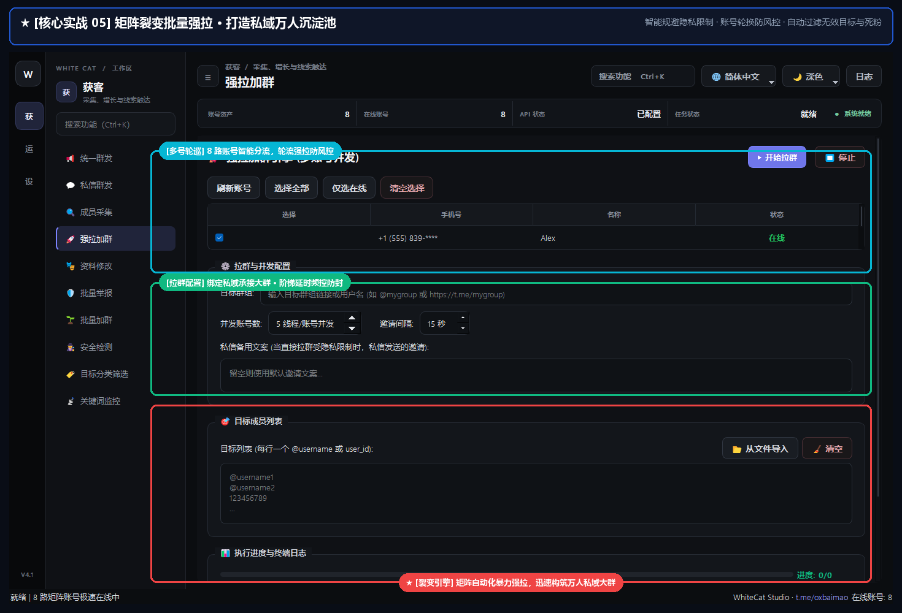

# 09. 强拉加群

> 📌 **模块分类**：海外精准获客与流量裂变  
> 💡 **核心定位**：利用 Telegram MTProto 协议底层接口，将采集到的高意向目标潜客批量强制拉入自建的私域群组或频道。

---

## 一、解决的核心商业痛点
自建群冷启动极其困难，发广告别人不肯主动点击加群链接，社群毫无活跃人气。

---

## 二、界面实战图解

  

---

## 三、功能特性一览
- 支持将名单批量拉入超级群（Supergroup）与普通群组
- 多管理员账号并发拉人，自动均衡分配拉人配额，防触发 PeerFlood 限制
- 支持检测目标用户的隐私加群权限（自动跳过不允许任何人加群的严格隐私账号）
- 拉入成功后自动记录历史，避免同一个人被重复拉入

---

## 四、标准实战操作指南
1. 确保负责执行强拉的账号已加入自建目标群，并拥有管理员或普通群员拉人权限；
2. 输入自建目标群组链接，并导入待拉入的潜客 UserID/Username 列表；
3. 设置每号单批次拉人数量（建议每号单次拉 5~15 人，间隔 60 秒以上）；
4. 点击「开始强拉」，系统将自动执行邀请，目标用户无需点击同意即直接出现在您的社群成员列表！

---

## 5.0.1 重构：让「拉入」名副其实

- **开始前预检**：逐个核实选中的账号确实在目标群里、有拉人权限；不合格的自动排除并写明原因（例如「不在目标群里」「目标群不允许普通成员拉人」）。同时显示今日「拉人」风控额度与预计耗时。
- **拉入才算拉入**：新版 Telegram 对隐私受限的人不会报错，而是悄悄不拉；现在逐个检查结果，并回读对方是否真的在群里，不再把「接口返回成功但没进去」算成功。
- **私信邀请只算「已发邀请」**：对方隐私受限时可改发私信邀请链接，但对方点了才入群，不计入「拉入」。
- **每个账号独立节奏**：独立的邀请间隔与「每个账号最多拉 N 人」；遇到限流 / 被限制主动联系陌生人的账号会单独冷却，不会反复撞墙。
- **更安全**：加联系人重试默认关闭，且不再向对方暴露你的手机号。
- **失败原因用人话**，结束时汇总，并可「复制失败名单」粘回重试。

---

## 五、工业级防封与实战秘诀
- 自建群组在强拉前最好先利用「AI 炒群」铺垫好 50~100 条真实讨论记录，避免新用户进群后看到空群立刻退群；
- 新创建的群组前 3 天建议循序渐进，第一天拉 100~200 人，后续逐步放大拉人规模。

---

  <a href="../USER_MANUAL.md">⬅️ 返回总目录</a> | <a href="https://github.com/ChiSonKon/tg-sender-releases">🏠 返回项目首页</a>

