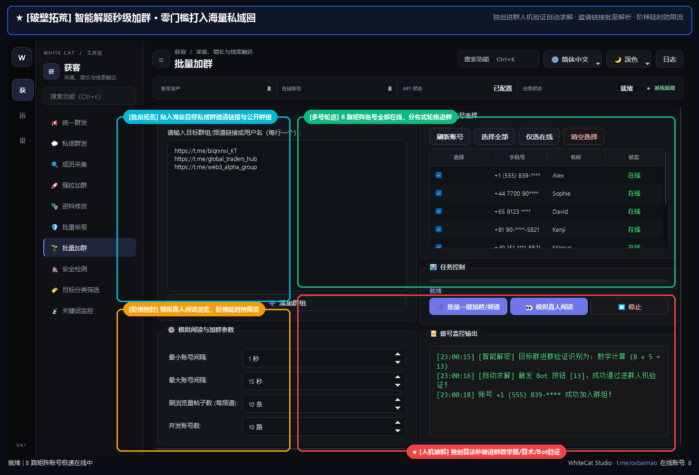

# 10. 批量加群与养号

> 📌 **模块分类**：海外精准获客与流量裂变  
> 💡 **核心定位**：新号池矩阵自动化预热与批量进群系统，模拟真人浏览、点击链接进群与自动求解进群人机验证。

---

## 一、解决的核心商业痛点
刚买的新账号一发消息就死号，手动去几十个群点击加群效率极其低下，遇到复杂验证码无法通过。

---

## 二、界面实战图解

  

---

## 三、功能特性一览
- 支持公开群组链接与私密加群链接（t.me/+xxx）批量导入与矩阵加群
- 内置智能进群人机验证求解：自动点击 Inline 按钮（如「点此通过验证」）、数学加减法求解
- 拟真人暖号行为模拟：加群后自动停留浏览历史消息、随机点赞表情（Reactions）
- 进群频率智能控速，彻底杜绝短时间内疯狂加群触发官方封号

---

## 四、标准实战操作指南
1. 选择需要养护的新账号列表；
2. 在目标列表粘贴准备好的热门社群链接（可从垂直行业大群采集）；
3. 设置每个账号计划加入的群数（如每天 3~5 个群）及间隔时间；
4. 开启「自动求解进群验证」开关，点击「批量一键加群/频道」；
5. 系统将自动处理入群请求，并完成验证机器人给出的挑战。

---

## 5.0.1 新增

- **开始前预检**：点「批量一键加群」先预检——账号有没有被冻结、每个账号已加入多少群还能再加多少、今日入群额度、AI 是否就绪、预计耗时与「按每日额度约需几天」；预检过程有进度，可取消。
- **入群验证新类型**：「先加入某频道，再点『完成验证』」自动求解（先用同一账号加频道，再点按钮，复查是否解除禁言）。
- **账号早就在群里却被禁言**：验证按钮只在刚入群时出现。可勾选「退群重进再过验证」（仅公开群；账号入群额度不够时不会退群，避免回不去）。
- **找不到群**：先用全局搜索兜底，再换账号重试，最后给出人话提示。
- **退出黑名单里的群**：「🚪 退出黑名单里的群」扫描所选账号已加入的群，由你勾选、设置并发后批量退出（白名单的群永不推荐；私有群会标出，退出后需要邀请链接才能回来）。
- **待补群清单**：群发时发现没有可用账号的群会自动攒起来，这里一键载入。
- **并发提醒**：并发超过 3 而账号还在用本机网络时会提醒（可忽略），并可一键跳到代理管理。

---

## 五、工业级防封与实战秘诀
- 养号黄金法则是「慢即是快」，新号第一周保持加群和自然阅读，第二周再开启轻量私聊，账号寿命可长达数月乃至数年；
- 遇到需要 Bot 发私聊验证的极个别群组，系统支持通过 MCP 智能体无缝将截图交由大模型实时求解。

---

  <a href="../USER_MANUAL.md">⬅️ 返回总目录</a> | <a href="https://github.com/ChiSonKon/tg-sender-releases">🏠 返回项目首页</a>

