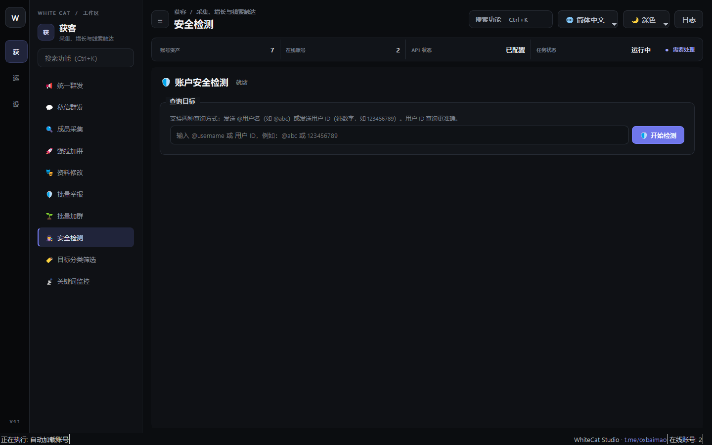

# 12. 安全检测

> 📌 **模块分类**：海外精准获客与流量裂变  
> 💡 **核心定位**：账号池全自动健康度体检诊断系统，深度查询 Telegram 官方限制、SpamBot 受限详情及精确解封时间。

---

## 一、解决的核心商业痛点
账号被限制了自己完全不知情，依然在跑群发和加群任务，结果全都是无用功并导致封禁恶化。

---

## 二、界面实战图解

  

---

## 三、功能特性一览
- 一键批量对号池执行全局健康度扫描，检测 Session 是否依然有效活着
- 自动向官方 @SpamBot 发起交互会话，提取官方原始回复文本
- 智能结构化提取受限性质（如「双向受限」、「群发禁言」）及 UTC 精确解封时间点
- 提供一键「清理失效/被限制账号」并安全隔离归档

---

## 四、标准实战操作指南
1. 选择需要体检的账号列表；
2. 点击「启动安全检测」；
3. 等待检测完成，表格中将呈现每个账号的「健康状态」、「SpamBot 详细报告」及「预计解封时间」；
4. 点击「一键隔离异常账号」，系统会自动将不可用的死号从活跃工作池中剥离至归档文件夹。

---

## 五、工业级防封与实战秘诀
- 大部分轻度双向限制通常会在 24~72 小时内自动解除，切勿在受限期间强行使用该账号进行任何操作；
- 每天开始大型群发任务之前，先跑一次「安全检测」，能确保后续任务成功率稳定在 95% 以上。

---

  <a href="../USER_MANUAL.md">⬅️ 返回总目录</a> | <a href="https://github.com/ChiSonKon/tg-sender-releases">🏠 返回项目首页</a>

