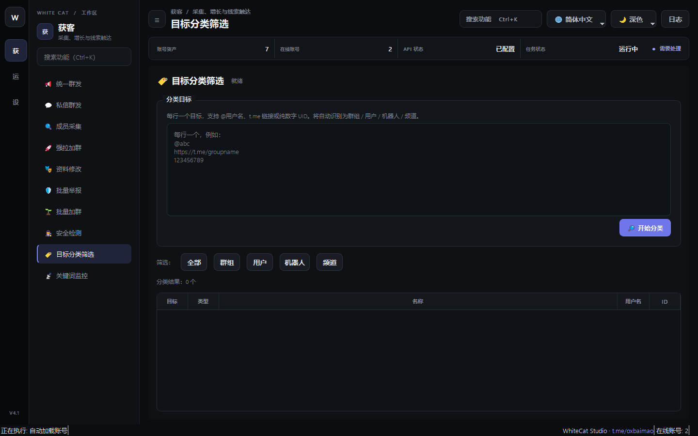

# 13. 目标分类筛选

> 📌 **模块分类**：海外精准获客与流量裂变  
> 💡 **核心定位**：客户画像多维度清洗与潜客分层漏斗，将粗颗粒度的海量采集数据提炼为高意向、高净值的优质客户池。

---

## 一、解决的核心商业痛点
采集了 10 万个名单，里面既有同行管理人员、又有外语散户，盲目群发不仅成本高且容易招致大量投诉。

---

## 二、界面实战图解

  

---

## 三、功能特性一览
- 按身份角色识别：自动标识群主、管理员、活跃普通群员、 Bot 机器人
- 语言与地域分流：根据群员昵称与个性签名自动判定母语（中文/英语/俄语/西语等）
- 按活跃度与历史行为权重赋分，智能打上「高意向大客户」、「普通潜在用户」等标签
- 支持将清洗后的分层数据直接一键投递给「私信群发」或「强拉加群」模块

---

## 四、标准实战操作指南
1. 在页面中导入先前采集的原始名单 CSV 文件；
2. 在筛选面板勾选过滤条件（如：排除管理员、只保留使用特定语言、最近 3 天有发言记录）；
3. 点击「开始分类筛选」，系统将在毫秒之间完成数十万行数据的深度清洗；
4. 查看清洗结果汇总，点击「保存清洗后名单」或直接「一键推送到私信任务」。

---

## 五、工业级防封与实战秘诀
- 排除掉群主和管理员之后再去私聊，被举报（Spam Report）的概率会骤降 80% 以上！
- 根据语言分流后，配合对应语种的营销话术开展精准营销，转化率提升尤为明显。

---

  <a href="../USER_MANUAL.md">⬅️ 返回总目录</a> | <a href="https://github.com/ChiSonKon/tg-sender-releases">🏠 返回项目首页</a>

