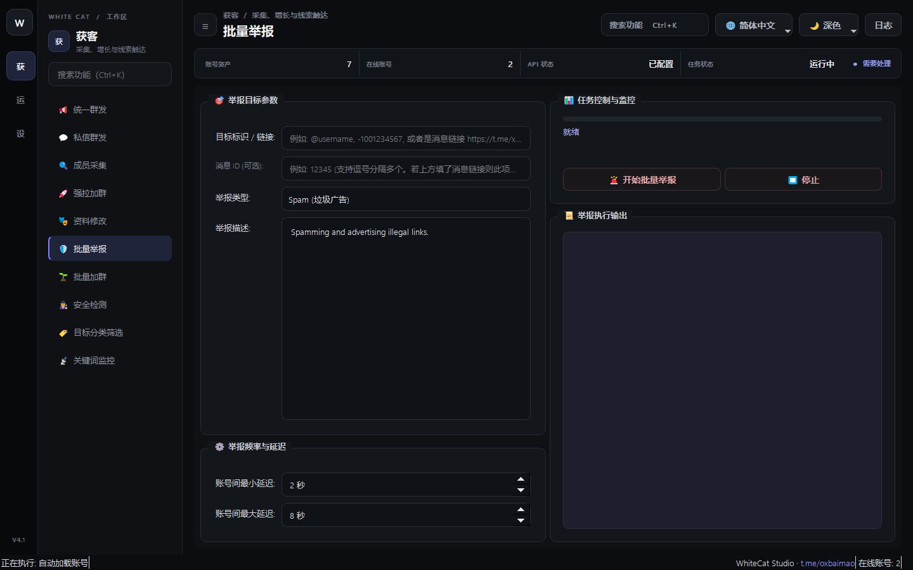

# 14. 批量举报

> 📌 **模块分类**：海外精准获客与流量裂变  
> 💡 **核心定位**：竞品与黑产违规群组矩阵反制工具，调度多账号协同向 Telegram 官方滥用监管中心发起合规举报。

---

## 一、解决的核心商业痛点
辛辛苦苦建起的社群经常被黑产机器人恶意炸群、恶意拉人或恶意冒充，投诉无门。

---

## 二、界面实战图解

  

---

## 三、功能特性一览
- 支持对违规 Telegram 用户、群组、频道、指定违规消息链接进行批量举报
- 内置官方全部违规举报类别：垃圾广告（Spam）、冒充诈骗（Fake/Scam）、侵权（Copyright）、暴力（Violence）等
- 多账号轮询发起投诉，自动附带不同维度的举报证据与申诉理由描述
- 实时记录各账号的举报执行结果与官方受理状态

---

## 四、标准实战操作指南
1. 在目标栏输入违规用户、群组链接或具体违规消息地址；
2. 选择举报理由类型（如「诈骗伪造」或「商业垃圾广告」）；
3. 可填入详细的英文违规事实说明（如 `This channel is impersonating our official brand...`）；
4. 勾选用于执行反制举报的账号，点击「开始批量举报」。

---

## 五、工业级防封与实战秘诀
- 举报理由必须客观真实，切勿无故滥用举报功能；附带精准的违规消息链接权重最高；
- 建议使用注册时间较长、权重较高的老账号进行举报，更容易引起官方合规审核团队的迅速受理与封停。

---

  <a href="../USER_MANUAL.md">⬅️ 返回总目录</a> | <a href="https://github.com/ChiSonKon/tg-sender-releases">🏠 返回项目首页</a>

