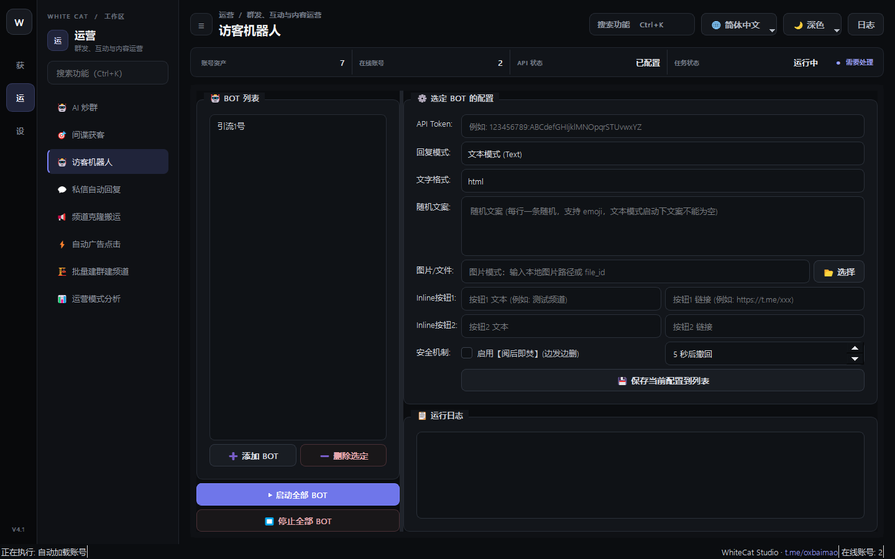

# 17. 访客机器人

> 📌 **模块分类**：社群活跃与 AI 自动化运营  
> 💡 **核心定位**：自建社群与频道的拟真访客巡游自动化系统，模拟自然用户的进群、浏览、在线、潜水与自然交互。

---

## 一、解决的核心商业痛点
自建群成员数量看着多，但「当前在线人数」只有个位数，真实客户进群后觉得是死群，毫无信任感。

---

## 二、界面实战图解

  

---

## 三、功能特性一览
- 批量调度矩阵账号在不同时段轮流保持「在线（Online）」状态
- 自动模拟在群内滑动浏览历史消息，触发 Telegram 底层的消息阅读量（Views）增加
- 支持进出群动态拟真：按自然规律每天少量进群、偶尔退群，完全符合真实社群成长曲线
- 支持对频道或群组重要消息批量自动添加正向表态（Emojis 表情点赞）

---

## 四、标准实战操作指南
1. 选择用于维护社群热度的访客账号批次；
2. 输入自建目标群组或频道链接；
3. 设置日间/夜间在线比例分布，设定阅读消息的滑动深度；
4. 点击「启动访客巡游」，系统将在云端平滑维持社群的高在线人数指标。

---

## 五、工业级防封与实战秘诀
- 在重要营销公告发布后，使用访客机器人为该消息一键刷上 50~100 个点赞（👍/🔥/❤️），从众心理会促使真实客户更快信任并转化；
- 在线时段建议参考目标市场目标用户的时区（如东南亚、欧美或中东时间）进行针对性配置。

---

  <a href="../USER_MANUAL.md">⬅️ 返回总目录</a> | <a href="https://github.com/ChiSonKon/tg-sender-releases">🏠 返回项目首页</a>

