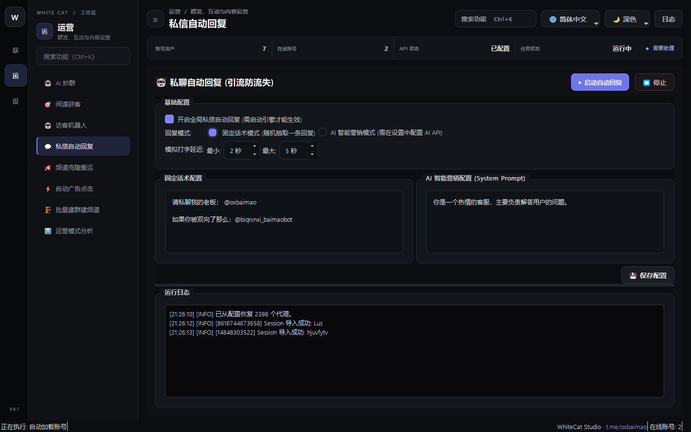

# 18. 私信自动回复

> 📌 **模块分类**：社群活跃与 AI 自动化运营  
> 💡 **核心定位**：7×24 小时全天候智能客服与线索承接中枢，支持精准规则触发与 AI 大模型智能多轮问答接客。

---

## 一、解决的核心商业痛点
时差原因晚上无法及时回复客户导致成单流失，多账号群发后同时涌入上百个客户咨询，人工回复手忙脚乱。

---

## 二、界面实战图解

  

---

## 三、功能特性一览
- 规则匹配引擎：支持关键词精确匹配、模糊包含匹配，支持设置回复延迟防秒回风控
- AI 智能意图识别：挂载大模型，根据设定的公司业务知识库，自动扮演专业销售顾问进行问答
- 支持图文、价格表附件自动发送，支持将聊到成熟阶段的意向客户自动转交人工 Telegram
- 多账号集中式应答：所有工作账号收到的私聊消息，由同一系统集中智能应答处理

---

## 四、标准实战操作指南
1. 在「自动回复配置」中添加常见问答规则（例如：关键词 `价格|多少钱` ➔ 回复产品报价单）；
2. 开启「AI 智能客服模式」，在提示词栏填入公司业务背景与承接话术；
3. 设置回复延迟参数（推荐 3~10 秒，模拟真人打字反应时间）；
4. 点击「启动自动回复」，系统即刻接管所有在线账号的来信咨询。

---

## 五、工业级防封与实战秘诀
- 千万不要设置「0秒立即秒回」，Telegram 底层对瞬间毫秒级回复陌生人私信非常敏感，设置 5 秒左右的拟真打字延迟最安全；
- 可在 AI 设定中加入限制：“遇到具体支付付款时，请引导客户联系唯一指定官方财务账号”，确保资金链路安全。

---

  <a href="../USER_MANUAL.md">⬅️ 返回总目录</a> | <a href="https://github.com/ChiSonKon/tg-sender-releases">🏠 返回项目首页</a>

