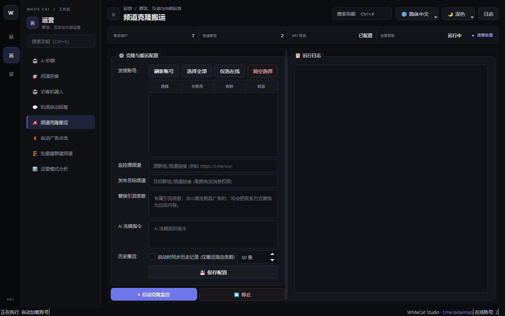

# 19. 频道克隆搬运

> 📌 **模块分类**：社群活跃与 AI 自动化运营  
> 💡 **核心定位**：高权重竞品频道内容一键全自动克隆、搬运与实时同步工具，快速构建专业度极高的私域内容矩阵。

---

## 一、解决的核心商业痛点
自建频道每天写文案、找配图耗费数小时；新频道空空如也，缺少长期运营积淀的内容支撑。

---

## 二、界面实战图解

  

---

## 三、功能特性一览
- 支持将公开或私密频道的历史所有文字、图片、视频、文件一键完整克隆至自建新频道
- 智能文本清洗替换：自动扫描原文中的竞品广告链接、联系方式，并一键替换为您自己的营销信息！
- 支持「实时监听同步」：竞品频道一旦更新发布新消息，自建频道在秒级内自动清洗并无缝同步发布
- 支持调整消息发布时间戳间隔，模拟长期循序渐进的日常发帖节奏

---

## 四、标准实战操作指南
1. 输入来源竞品频道链接，输入您拥有管理员权限的自建目标频道链接；
2. 在「内容替换规则」中配置替换字典（例如：将原文的 `@old_contact` 替换为 `@my_official`）；
3. 选择搬运范围（支持「全部历史消息」或「从最新第 N 条开始克隆」）；
4. 点击「开始克隆搬运」，系统将自动完成媒体下载、文本过滤、广告清洗并以您的频道身份重新发布！

---

## 五、工业级防封与实战秘诀
- 建议开启「自动抹除原文水印/转发来源标签」，克隆出来的消息将显示为您频道的原生原创发布；
- 同步大体积视频时，确保本地网络带宽充裕，系统会自动进行分片续传以保障完整性。

---

  <a href="../USER_MANUAL.md">⬅️ 返回总目录</a> | <a href="https://github.com/ChiSonKon/tg-sender-releases">🏠 返回项目首页</a>

