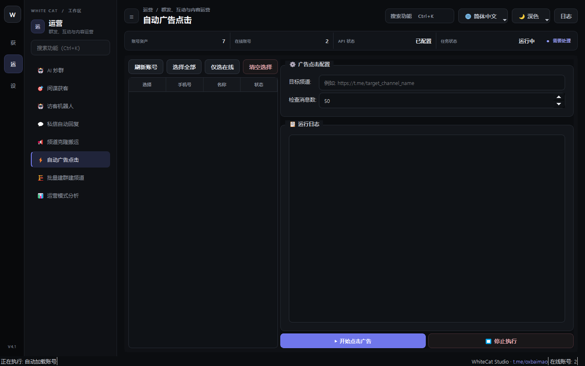

# 20. 自动广告点击

> 📌 **模块分类**：社群活跃与 AI 自动化运营  
> 💡 **核心定位**：Telegram 赞助广告（Telegram Ads）自动化巡回点击与互动工具，提高账号行为权重与官方引流效果。

---

## 一、解决的核心商业痛点
海外 Telegram 广告任务或自动化浏览需求繁琐，人工点击耗时低效。

---

## 二、界面实战图解

  

---

## 三、功能特性一览
- 自动识别目标公开大群或频道中出现的官方赞助广告按钮与卡片
- 多账号矩阵模拟真实用户进行周期性点击、跳转浏览与停留阅读
- 内置点击间隔防检测算法，完全规避机器人异常行为指纹
- 统计累计广告曝光量、有效点击量与跳转留存率数据报表

---

## 四、标准实战操作指南
1. 选择执行广告浏览任务的账号列表；
2. 指定需要巡查的目标频道或群组列表；
3. 设置随机浏览时长与点击概率阈值；
4. 点击「启动广告自动化任务」，系统将在后台安全静默运转。

---

## 五、工业级防封与实战秘诀
- 该模块不仅可用于广告互动，更是账号养护中极其重要的「日常自然行为模拟」利器；
- 配合代理池使用，可模拟来自全球不同地理位置的真实用户受众群体。

---

  <a href="../USER_MANUAL.md">⬅️ 返回总目录</a> | <a href="https://github.com/ChiSonKon/tg-sender-releases">🏠 返回项目首页</a>

