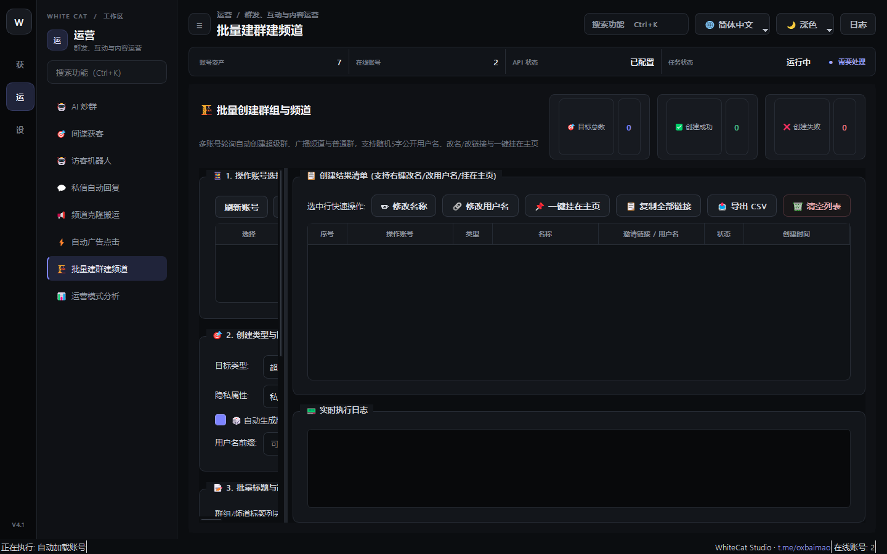

# 21. 批量建群建频道

> 📌 **模块分类**：社群活跃与 AI 自动化运营  
> 💡 **核心定位**：多账号矩阵公域霸屏与私域流量池批量搭建引擎，支持一键批量创建群组、公开超级群与广播频道。

---

## 一、解决的核心商业痛点
手动创建 50 个群组需要切换几十次账号、一个个打字上传头像，手指按到抽筋，速度奇慢。

---

## 二、界面实战图解

  

---

## 三、功能特性一览
- 支持指定账号矩阵批量并发创建公开群、私密群、广播频道
- 自动设定群组标题、随机描述、自动配置群组头像
- 自动开启聊天历史记录对新成员可见，一键关闭敏感权限（如防他人乱发贴纸）
- 创建完毕后自动导出所有新生成的群组/频道链接清单（含群组 ID、邀请链接、管理员归属）

---

## 四、标准实战操作指南
1. 选择拥有建群权限的在线账号池；
2. 在创建模版中配置名称前缀（如 `全球出海交流群_{index}`）、描述模版及公用头像；
3. 设定每个账号计划创建的群数量（建议每号每天创建 2~5 个）；
4. 点击「开始批量创建」，稍等片刻即可一键导出整整一张完整的矩阵社群资产表格！

---

## 五、工业级防封与实战秘诀
- 批量创建的公开超级群若能抢注到垂直行业核心大词用户名（@username），自然搜索带来的被动泛流量将源源不断；
- 创建完毕后，可无缝衔接「批量加群」让其他小号矩阵进群，再通过「AI炒群」快速把场子做热！

---

  <a href="../USER_MANUAL.md">⬅️ 返回总目录</a> | <a href="https://github.com/ChiSonKon/tg-sender-releases">🏠 返回项目首页</a>

