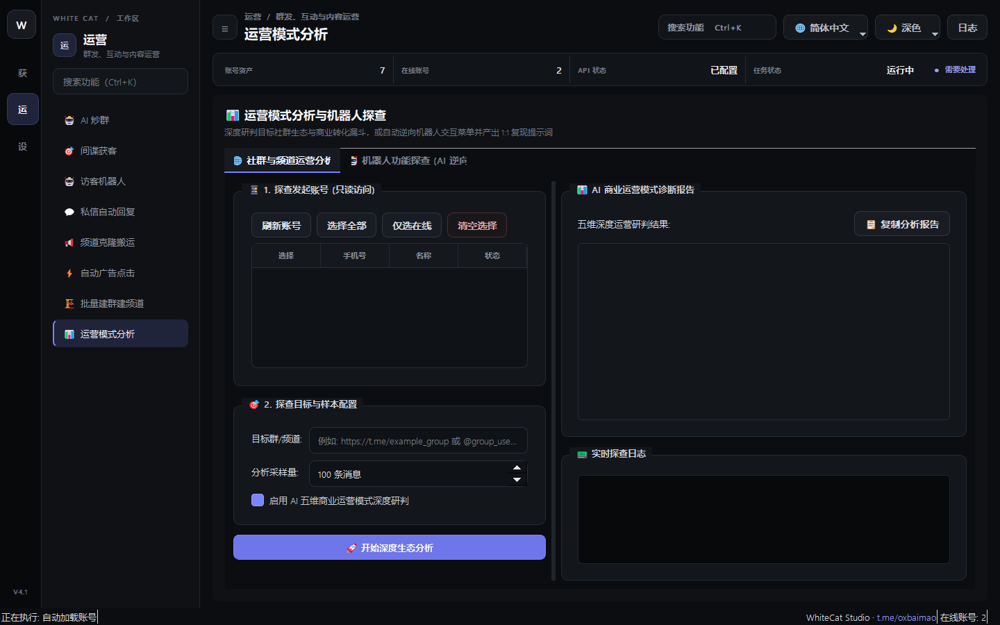

# 22. 运营模式分析

> 📌 **模块分类**：社群活跃与 AI 自动化运营  
> 💡 **核心定位**：商业化全盘营销数据看板与决策驾驶舱，深度剖析社群生态健康度、获客转化漏斗与多账号产出 ROI。

---

## 一、解决的核心商业痛点
每天投了很多号、发了很多信，究竟哪套话术回复率高？哪个群产出的客户多？心里完全没有数据支撑。

---

## 二、界面实战图解

  

---

## 三、功能特性一览
- 全局可视化统计：累计发送量、触达成功率、回复咨询率、封号率多维联动统计
- 话术效果 A/B 测试对比：自动分析不同话术模版的客户反响与转化周期
- 社群生态画像：分析监控群活跃发言高峰期（时段分布图），指导最佳发信黄金时间
- 支持生成标准化商业获客分析报表，支持一键导出 CSV / PDF

---

## 四、标准实战操作指南
1. 进入「运营模式分析」页面；
2. 选择需要分析的时间跨度（今日、过去7天、本月或自定义周期）；
3. 查看各模块产出看板，分析哪个账号表现最稳定、哪个关键词命中率最高；
4. 根据数据反馈优化发信时间段与话术内容，实现业务获客效率的持续复利增长。

---

## 五、工业级防封与实战秘诀
- 建议每周复盘一次转化报表，将回复率低于 2% 的劣质话术果断迭代，把精力集中在转化率最高的前 20% 核心场景；
- 结合 Telegram 海外不同时区的高峰发言期（通常为当地时间 14:00~16:00 和 20:00~22:00），集中进行发信与炒群，获客效果事半功倍！

---

  <a href="../USER_MANUAL.md">⬅️ 返回总目录</a> | <a href="https://github.com/ChiSonKon/tg-sender-releases">🏠 返回项目首页</a>

