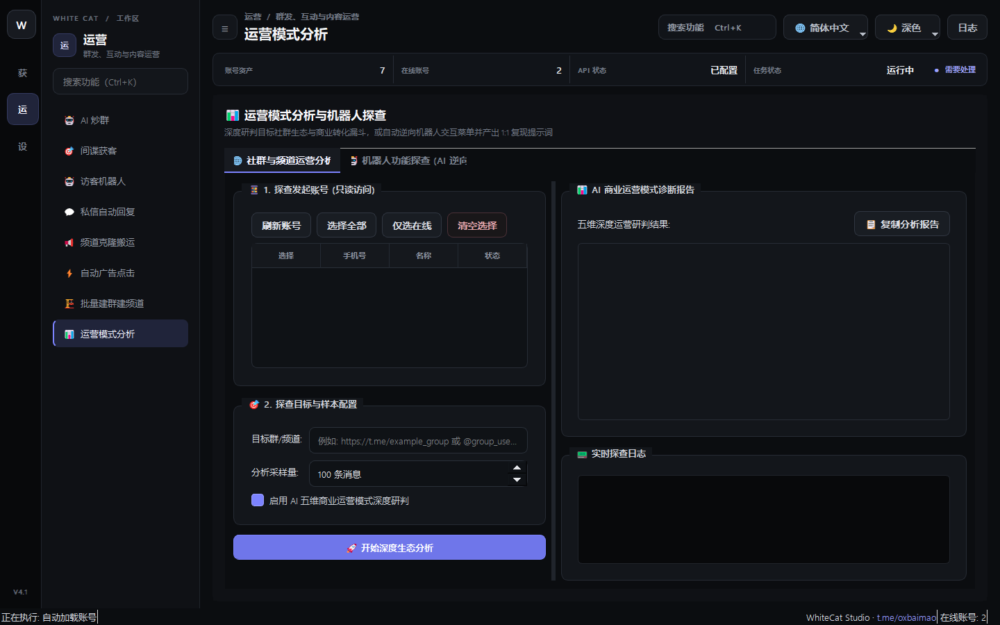

# 22. 运营模式分析

> 📌 **模块分类**：社群活跃与 AI 自动化运营
> 💡 **核心定位**：研究同行的群 / 频道怎么运营、机器人怎么设计——先给真实统计事实，再（可选）AI 解读。

---

## 一、解决的核心商业痛点
想学同行的打法，却只能凭感觉：这个群到底活不活跃？流量往哪里导？它的机器人菜单是怎么设计的？

---

## 二、界面实战图解

  

> 截图为演示数据，5.0.1 起界面布局有调整（右侧改为页签），以实际软件为准。

---

## 三、功能特性一览（5.0.1 重做）
本页分两个子页，**都需要一个已连接的账号**；没有账号时软件会直接提示，**不会出示例数据**。

### 🌐 社群与频道运营分析
- 真实读取目标群 / 频道的**成员数、在线人数、简介、置顶**和最近 N 条消息；
- 先给**统计事实**：内容构成（文字 / 图片 / 视频…）、发言集中度（最活跃的几个人占多少）、回复 / 转发 / 含链接占比、**本机时间**的发言高峰、外链域名、出现的机器人、价格 / 联系方式引导等转化信号、话题标签；读不到的数据会明确写「读取不到」；
- 勾选「用 AI 解读」且已在设置里配置 AI 时，AI **只依据这些事实**做 5 维解读（定位与受众、引流转化链路、内容节奏、变现线索、可借鉴做法与风险），数据不足的维度写「数据不足」；没配置 AI / 调用失败时只给统计，并写明原因；
- 样本只是最近一小段消息，不代表整个社群。报告可复制或保存为文件。

### 🤖 机器人功能探查
- 向目标机器人发 /start，读取它**自己声明的指令与简介**，逐层点击菜单按钮，得到**菜单树**和「复现提示词」（有 AI 时由 AI 润色，否则用只含探查事实的内置模板）；
- **默认只读安全**：跳过购买 / 支付 / 充值 / 提现 / 确认 / 删除 / 退出类按钮；外链、小程序、支付发票、分享手机号 / 位置按钮**任何时候都不点**。「🛡 跳过可能产生费用 / 不可逆的按钮」开关由你决定是否关闭，关闭前会提示后果；每个被跳过的按钮都列出原因；
- 有点击上限与间隔，被限流立即停止并保留已探查的部分；遇到验证码交给你人工处理；
- **群管 / 验证 / 欢迎类机器人**只有被拉进群或频道才有完整功能：软件会依据机器人资料识别并提醒，请让 AI Agent 通过 MCP 的 `tg_probe_bot_features`（`group_mode`）在**临时测试群**里完整探查——先 `dry_run` 预览计划与副作用，确认后才创建群、拉入机器人并设为管理员，探查结束自动删除测试群。

---

## 四、标准实战操作指南
1. 进入「运营模式分析」，在对应子页选一个在线账号（不选则自动用第一个已连接的账号）；
2. 群分析：填目标群 / 频道，选采样量，点「开始分析」；机器人探查：填机器人用户名，点「开始探查」并确认；
3. 看右侧的报告 / 菜单树 / 复现提示词；需要时复制或保存；
4. 结果提示「需要拉进群才能完整探查」时，把「复制给 AI Agent 的指令」粘贴给你的 Agent。

---

## 五、风险与秘诀
- 机器人探查会用你的账号向机器人发消息、点按钮；请只探查你有权研究的机器人，对有余额的机器人尤其谨慎（风险词表是启发式的，可能误跳过正常按钮，也可能漏掉用别的词表达的危险按钮）；
- 真实群 / 机器人形态千差万别（输入框式向导等探查不到），结果只代表这次点到的分支；
- 群分析的发言高峰按**本机时区**显示，复盘时请换算成目标受众所在时区。

---

  <a href="../USER_MANUAL.md">⬅️ 返回总目录</a> | <a href="https://github.com/ChiSonKon/tg-sender-releases">🏠 返回项目首页</a>

