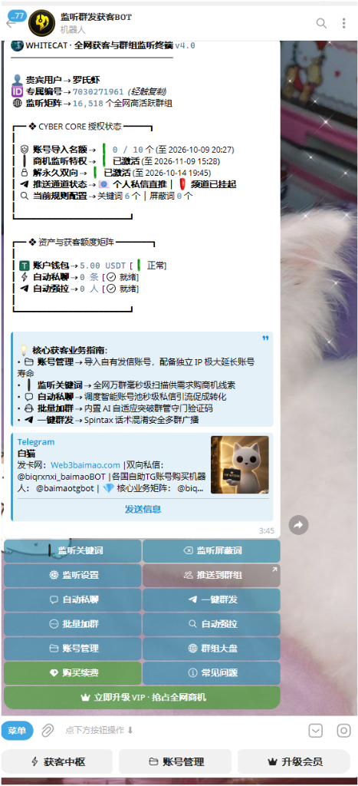

# 📱 手机端获客机器人 · 快速入门与中枢概览

> 🤖 **官方机器人直达**：[@wchjbot](https://t.me/wchjbot)  
> 💡 **核心定位**：专为移动端打造的 **7×24H 云端自动化获客与群组监听终端 (v4.0)**。无需常开电脑，手机端随时随地监控全网万群商机、一键发起高并发群发与私聊引流！

---

## 一、为什么选择手机端获客机器人？

| 对比维度 | 传统电脑客户端模式 | 手机端获客机器人 (@wchjbot) |
| :--- | :--- | :--- |
| **设备依赖** | 必须保持电脑开机且保持网络连通 | **零设备依赖**，手机、平板或网页随时操作 |
| **部署成本** | 需配置本地 Python/系统环境或下载解压 | **零门槛免安装**，Telegram 点击即可使用 |
| **商机时效** | 离开电脑容易错过高意向买家发言 | **秒级即时推送**，手机收到商机弹窗即刻点击跟进 |
| **云端挂机** | 断电断网任务即中断 | **24H 云端持久在线**，矩阵监听与定时任务全天运转 |
| **协同作战** | 适合深度批量治理、大批量建群与本地 MCP | 与电脑端账号共享，形成**“电脑重度营销 + 手机全天截流”**双引擎 |

---

## 二、机器人主控面板实战界面

  

---

## 三、主控中枢核心能力透视

### 1. 📡 16,518+ 全网高活跃群组监听大盘
- 官方预设并每日动态更新的 **1.6万+ 行业超级大群生态库**，覆盖出海、跨境电商、Web3、数字营销等核心领域；
- 支持随时开启官方精选大盘，亦支持一键上传自定义群组链接或 TXT 文档批量接入。

### 2. 🛡️ CYBER CORE 企业级多维授权体系
- **账号导入名额**：支持在手机端直接挂载绑定自有 Telegram 发信账号池（支持配备独立代理 IP，极大延长账号寿命）；
- **商机监听特权**：毫秒级全网群聊关键词秒级捕获；
- **解永久双向受限**：集成官方 SpamBot 快速救号通道，保障账号资产健康；
- **智能推送通道**：支持直接通过机器人 1v1 私信通知，或转发至用户专属的工作大群/通知频道。

### 3. ⚡ 资产与获客额度矩阵
- **账户钱包 (USDT)**：清晰展示账户当前余额，支持自动扣费与弹性按需采购；
- **自动私聊额度**：调度云端智能发信号池秒级向意向潜客发起私信破冰；
- **自动强拉额度**：直接将采集到的目标客户强制拉入您的私域大群，快速沉淀私域流量池。

---

## 四、极速上手指南（30 秒唤醒）

1. **点击唤醒机器人**：在 Telegram 中搜索并进入 **[@wchjbot](https://t.me/wchjbot)**；
2. **启动终端**：点击底部的 `开始` 或发送 `/start` 指令；
3. **查看专属状态**：系统将自动为您分配专属客户编号（如 `7030271961`），并展示实时资产与监听大盘；
4. **设置商机监控**：点击【**监听关键词**】输入您的业务关键词（如“求购”、“报价”、“合作”），全网商机捕获即刻生效！

---

  <a href="../SUMMARY.md">⬅️ 返回文档目录</a> | <a href="02_keyword_monitor.md">下一章：关键词商机实时监听 ➡️</a>

\n