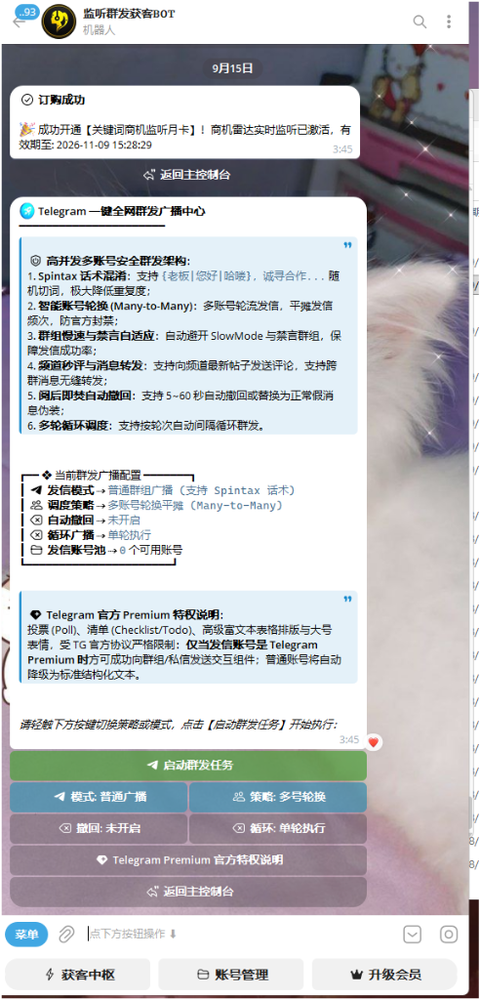

# 📢 Telegram 一键全网群发广播中心

> 💡 **核心定位**：高并发多账号安全群发架构。支持 Spintax 话术混淆、多账号轮换平摊、慢速禁言自适应与阅后即焚防撤回伪装！

---

## 一、群发广播中心实战界面

  

---

## 二、高并发多账号安全群发 6 大底层架构

### 1. 🔀 Spintax 话术高级混淆切词
- 彻底告别“千人一面被 Telegram 查重秒封”；
- 语法支持嵌套：`{老板|您好|哈喽}，诚寻{外贸|跨境|出海}合作伙伴，支持{担保|直签}！`；
- 每次发信在发信端毫秒级随机组合渲染，生成数万种不重样的文案指纹，极大降低内容特征重复度。

### 2. 👥 智能账号轮换 (Many-to-Many 架构)
- 支持接入多路发信账号，系统自动采取“账号 A 发 3 条 ➔ 账号 B 发 3 条 ➔ 账号 C 发 3 条”的分布式循环调度策略；
- 将每日上万条曝光请求平均平摊到各个矩阵号，严格控制单号发信频次，账号存活周期提升 5~10 倍。

### 3. 🐢 群组慢速与禁言自适应感知
- 自动避开开启了 **SlowMode（发言慢速限制）** 或 **全员禁言** 的无效群组；
- 遇到禁言群自动记录并跳过，绝不卡死任务进度，保障广播任务高并发顺畅进行。

### 4. 💬 独创频道评论区秒评截流
- 支持直接向目标大频道的最新帖子发送评论，精准截取正在浏览大频道资讯的数万活跃粉丝关注；
- 支持跨群无缝转发精品帖子，打造高信任的转发背书。

### 5. ⏱️ 阅后即焚自动撤回与伪装
- 支持设定在消息发出后 **5~60 秒自动撤回**，或者**自动替换为正常的日常问候假消息**；
- 达到“既让群里在线潜客看到了广告，又在管理员反应过来前自动消除痕迹”的无痕获客境界。

### 6. 🔁 多轮循环自动化调度
- 支持设置广播间隔（如每 2 小时一轮），系统在云端全天候无人值守自动循环广播，源源不断产生咨询与询盘。

---

## 三、Telegram 官方 Premium 特权支持说明

> 💎 **高转化组件赋能**：
> 投票 (Poll)、清单 (Checklist/Todo)、高级富文本表格排版与大号表情，受 Telegram 官方协议严格限制。
> 当您绑定的发信账号是 **Telegram Premium** 会员时，系统将自动解锁向群组与私聊发送这些交互组件的特权；若使用普通账号，系统会自动平滑降级为标准的结构化富文本，保障 100% 投递成功！

---

  <a href="02_keyword_monitor.md">⬅️ 上一章：关键词商机监听</a> | <a href="04_membership.md">下一章：资产充值与多账号月卡 ➡️</a>

\n