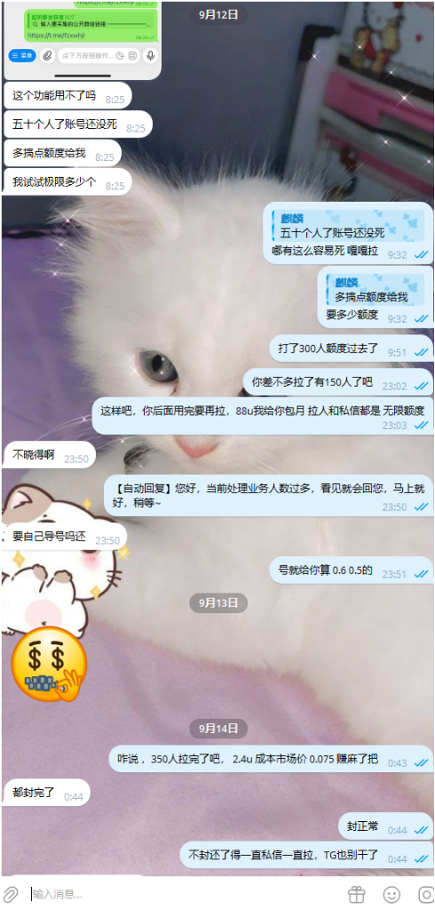

# 🏆 真实客户实战拉群与盈利战报

> 💡 **实盘实测**：拒绝虚假宣传，用真实客户聊天记录与真实拉人投产比说话！单号强拉 350+ 人，成本仅 2.4U，远超行业平均水平！

---

## 一、真实客户实战聊天记录截屏

  

---

## 二、实战案例复盘与深度剖析

### 1. 客户现场实况对话还原：
- **客户早间实测**：“五十个人了账号还没死，多搞点额度给我，我试试极限多少个！”
- **技术指导**：“哪有这么容易死，嘎嘎拉！打了 300 人额度过去了，88U 包月拉人和私信都是无限额度，号按 0.5~0.6U 算！”
- **次日战果汇报**：“350 人拉完了，2.4U 成本，市场价 0.075 赚麻了吧！”
- **总结心态**：“封号正常，不封还得一直私信一直拉，TG 官方也别干了。核心是算总账——单号拉满 350 人创造的商业价值远大于账号成本！”

---

## 三、真实投产比 (ROI) 算账：为什么客户说“赚麻了”？

我们用最严格的商业数据来测算这笔账：

| 成本与产出项目 | 传统人工/劣质外挂数据 | 白猫获客助手实战数据 |
| :--- | :--- | :--- |
| **单号强拉人数极限** | 10~20 人即被官方封禁 | **350+ 人 / 账号**（实操验证） |
| **单号采购成本** | 0.8 ~ 1.2 USDT | **0.5 ~ 0.6 USDT** |
| **拉入 350 人总耗号** | 需消耗 18~35 个号（成本约 25U） | **仅消耗 1~2 个号（成本约 2.4U）** |
| **市场拉人外包行情** | 0.075 ~ 0.10 USDT / 人 | 350 人市场外包价值约 **26.25 ~ 35 USDT** |
| **直接净利润空间** | 极低（常因大批封号导致亏损） | **净赚 23.85 ~ 32.6 USDT / 批次（投资回报率超 1000%）** |

---

## 四、为什么白猫助手能做到单号拉满 350 人？

1. **独立纯净代理一对一强隔离**：绝不用脏 IP、万人骑节点，每个号独立机房直连，杜绝连带风控；
2. **拟真人动态阶梯频控**：模拟真实用户点击、随机抖动延迟（5~15秒随机抖动），避开 Telegram 官方风控雷达的高频拦截；
3. **智能双向受限检测与自动申诉**：即使遇到官方临时限制，系统第一时间感知并停止强行操作，自动调起救号申诉流程，资产寿命最大化！

---

  <a href="04_membership.md">⬅️ 上一章：资产充值与订阅</a> | <a href="../USER_MANUAL.md">前往：电脑端 22 模块实战手册 ➡️</a>

\n